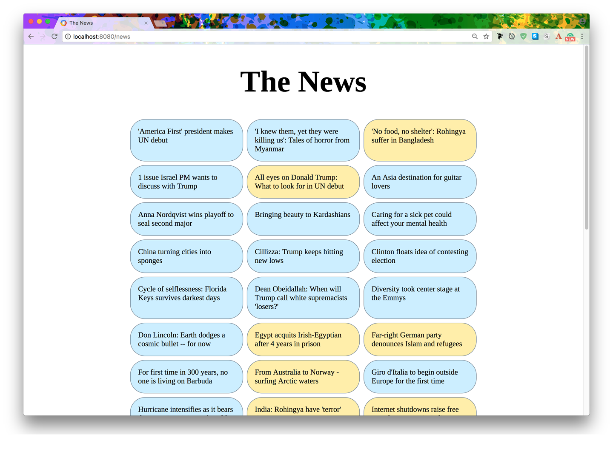
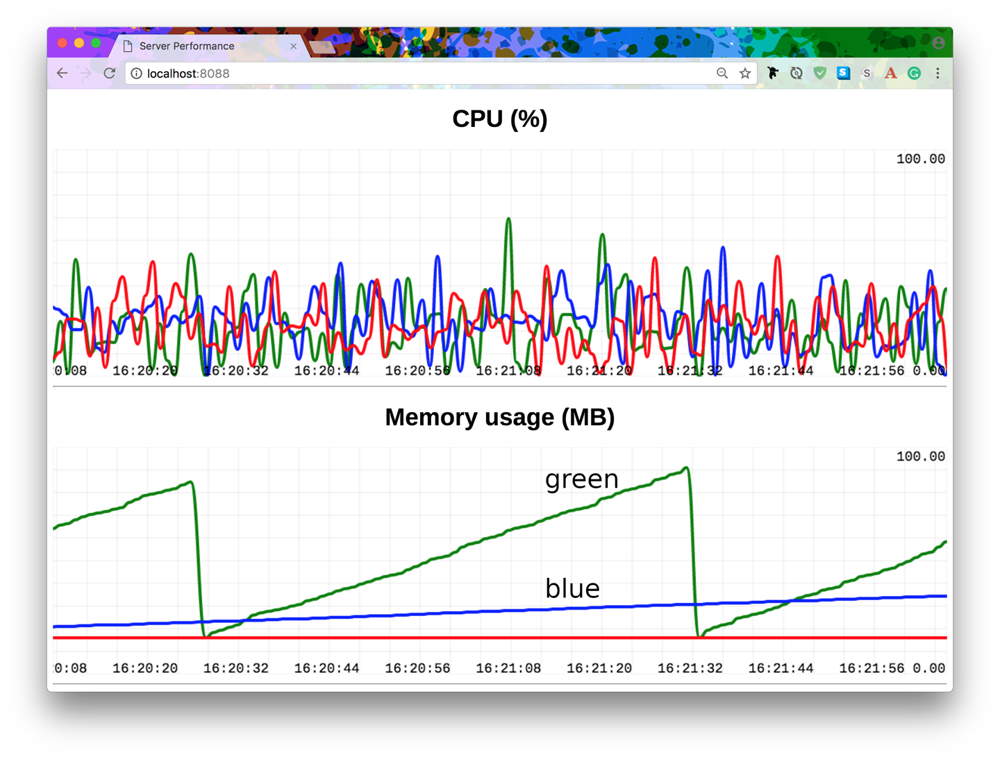

# فصل 4
# 20 کتابخانه Asyncio که از آن‌ها استفاده نمی‌کنید (اما اهمیتی ندارد)
<hr>


In this chapter, we look at case studies using the new Python features for async programming. We’ll be making use of several third-party libraries, as you will in your own projects.

در این فصل مواردی را با استفاده از امکانات جدید پایتون برای برنامه‌نویسی همزمان بررسی می‌کنیم. ما از چندین کتابخانه‌ی third-party استفاده خواهیم کرد؛ همانطور که شما نیز در پروژه‌های خود از آن‌ها بهره خواهید برد. 

The title of this chapter is a play on the title of a previous book I wrote called 20 Python Libraries You Aren’t Using (But Should) (O’Reilly). Many of those libraries will also be useful in your asyncio-based applications, but this chapter focuses on libraries that have been designed specifically for the new async features in Python.

عنوان این فصل نمایشنامه‌ای بر روی عنوان کتاب قبلی من با نام 20 Python Libraries You Aren't Using (But Should) (O'Reilly) است. بسیاری از آن کتابخانه‌ها برای اپلیکیشن‌های همزمان شما نیز مفید خواهند بود، اما این فصل بر روی کتابخانه‌هایی تمرکز دارد که به طور ویژه برای امکانات همزمان جدید پایتون طراحی شده‌اند.


It is difficult to present asyncio-based code in short snippets. As you have seen in all the previous code samples in the book, I’ve tried to make each example a complete, runnable program, because application lifetime management is a core consideration for using async programming correctly.

نمایش دادن کدهای همزمان به صورت تکه‌های کوتاه دشوار است. همانطور که نمونه کدهای پیشین در این کتاب را مشاهده کرده‌اید، تلاش کرده‌ام که هر مثال را به صورت برنامه‌ای کامل و قابل اجرا ارائه دهم، زیرا مدیریت طول عمر برنامه نکته‌ای اساسی برای استفاده صحیح از  برنامه‌نویسی همزمان است.  

For this reason, most of the case studies in this chapter will be somewhat larger, in terms of lines of code, than is usual for such a book. My goal in using this approach is to make the case studies more useful by giving you a “whole view” of an async program rather than leaving you to figure out how detached fragments might fit together.

به همین دلیل، بسیاری از موردپژوهی‌ها در این فصل از جهت تعداد خطوط کد تا حدودی بزرگ‌تر از حد معمول برای چنین کتابی خواهند بود. هدف من از به‌کارگیری این رویکرد مفیدتر کردن موردپژوهی‌ها با ارائه یک "نمای ی" از یک برنامه‌ی همزمان است تا شما دیگر ناچار به تطبیق قطعات جداگانه با یکدیگر نباشید.  

<!--  -->

> Some of the code samples in this chapter compromise on style in order to save space. I like PEP8 as much as the next Pythonista, but practicality beats purity!

برخی از مثال‌های این فصل به جهت صرفه‌جویی در فضا  شیوه‌نامه‌های نوشتاری را دنبال نمی‌کنند. من PEP8 را به انداز  Pythinosta بعدی دوست دارم، اما به طور عملی خلوص را شکست می‌دهد.

## Streams (Standard Library)
## کتابخانه Streams (کتابخانه استاندارد)
Before looking at third-party libraries, let’s begin with the standard library. The streams API is the high-level interface offered for async socket programming, and as the following case study will show, it’s pretty easy to use. However, application design remains complex simply because of the nature of the domain.

پیش از آنکه کتابخانه‌های third-party را بررسی کنیم، بهتر است از کتابخانه استاندارد شروع کنیم. streams API رابط کاربری سطح بالایی است که برای برنامه‌نویسی سوکت همزمان ارائه شده است، و همانطور که موردپژوهی بعدی نشان خواهد داد، استفاده از آن بسیار آسان است. با این وجود، طراحی برنامه همچنان به دلیل ماهیت این مبحث پیچیده است.

The following case study shows an implementation of a message broker, with an initial naive design followed by a more design. Neither should be considered production-ready; my goal is to help you think about the various aspects of concurrent network programming that need to be taken into account when designing such applications.

موردپژوهی‌‌ای که در ادامه به آن می‌پردازیم اجرای یک واسط پیام (message broker) را با یک طراحی اولیه ساده و به  دنبال آن یک طراحی سنجیده‌تر نشان می‌دهد. هیچ یک از این طراحی‌ها نباید جهت استفاده در محیط اماده‌ برای استقرار آماده در نظر گرفته شوند؛ هدف من این است که شما را به تفکر درباره جنبه‌های گوناگون برنامه‌نویسی شبکه همروند  (cuncurrent network programming) که باید در زمان طراحی چنین برنامه‌ای در نظر گرفته شوند وادار کنم.

### Case Study: A Message Queue

### موردپژوهی: صف پیام (Message Queue)
A message queue service is a backend application that receives connections from other applications and passes messages between those connected services, often referred to as publishers and subscribers. Subscribers typically listen to specific channels for messages, and usually it is possible to configure the message distribution in different channels in two ways: messages can be distributed to all subscribers on a channel (pub-sub), or a different message can go to each subscriber one at a time (point-to-point).

صف پیام یا همان message queue یک اپلیکیشن بکند است که از دیگر اپلیکیشن‌ها اتصالات را دریافت کرده و پیام‌هایی را میان سرویس‌های متصل رد و بدل می‌کند. از این سرویس‌ها معمولا با نام‌های انتشاردهندگان (publishers) و مشترکین (subscribers) یاد می‌شود. مشترکین معمولا جهت دریافت پیام‌ها به کانال‌های مشخصی گوش می‌دهند. معمولا می‌توان توزیع پیام در کانال‌های مختلف را به دو روش پیکربندی کرد: پیام‌ها می‌توانند به تمام مشترکین یک کانال ارسال شوند (pub-sub)، و یا هر بار یک پیام متفاوت می‌تواند به یک مشترک ارسال شود (point-to-point).

Recently, I worked on a project that involved using ActiveMQ as a message broker for microservices intercommunication. At a basic level, such a broker (server):

اخیرا، من بر روی پروژه‌ای کار کردم که در آن از ActiveMQ به عنوان واسط پیام برای ارتباط داخلی میکروسرویس‌ها استفاده شد. در سطح پایه، چنین واسطی (سرور) به شرح زیر عمل می‌کند:

- Maintains persistent socket connections to multiple clients
- Receives messages from clients with a target channel name
- Delivers those messages to all other clients subscribed to that same channel name

- اتصالات پایدار سوکت را برای چندین مشتری حفظ می‌کند
- پیام‌ها را از مشتری با نام کانال مورد نظر دریافت می‌کند
- پیام‌های دریافتی را به تمام مشتریان دیگری که از مشترکین کانال مورد نظر هستند ارسال می‌کند

I recall wondering how hard it might be to create such an application. As an added touch, ActiveMQ can perform both models of message distribution, and the two models are generally differentiated by the channel name:

به یاد می‌آورم که فکر می‌کردم ساخت چنین اپلیکیشنی می‌تواند تا چه حد مشکل باشد. به عنوان یک نکته اضافی، ActiveMQ می‌تواند هر دو مدل توزیع پیام را اجرا کند، و این دو مدل به طور کلی با توجه به نام کانال از یکدیگر متمایز می‌شوند: 

- Channel names with the prefix /topic (e.g., /topic/customer/registration) are managed with the pub-sub pattern, where all channel subscribers get all messages.
- Channel names with the prefix /queue are handled with the point-to-point model, in which messages on a channel are distributed between channel subscribers in a round-robin fashion: each subscriber gets a unique message.

- نام کانال‌ها با پیشوند topic/ (به طور مثال: /topic/customer/registration) با الگوی pub-sub مدیریت می‌شوند. در این مدل تمامی مشترکین کانال تمامی پیام‌ها را دریافت می‌کنند.
- نام کانال‌ها با پیشوند queue/ با استفاده از مدل point-to-point مدیریت می‌شوند. در این مدل پیام‌های یک کانال میان مشترکین کانال با الگوی round-robin توزیع می‌شوند. (هر یک از مشترکین یک پیام منحصر‌به‌فرد دریافت می‌کند)

In our case study, we will build a toy message broker with these basic features. The first issue we must address is that TCP is not a message-based protocol: we just get streams of bytes on the wire. We need to create our own protocol for the structure of messages, and the simplest protocol is to prefix each message with a size header, followed by a message payload of that size. The utility library in Example 4-1 provides read and write capabilities for such messages.

 در این موردپژوهی، ما با استفاده از این امکانات اولیه یک واسط پیام آزمایشی خواهیم ساخت. اولین مشکلی که باید به آن بپردازیم آن است که TCP یک پروتکل مبتنی بر پیام نیست. در این پروتکل ما تنها می‌توانیم جریانی از بایت‌ها را در شبکه دریافت کنیم. ما باید پروتکل خود را برای ساختار پیام‌ها ایجاد کنیم. ساده‌ترین پروتکل این است که هر پیام را با یک هدر اندازه شروع کرده و به دنبال آن پیامی با همان آن اندازه را قرار دهیم. کتابخانه‌ کاربردی در مثال 1-4 قابلیت خواندن و نوشتن را برای چنین پیام‌هایی فراهم مي‌کند.

***Example 4-1. Message protocol: read and write***

***مثال 1-4. پروتکل پیام: خواندن و نوشتن***


```python
# msgproto.py
from asyncio import StreamReader, StreamWriter 

async def read_msg(stream: StreamReader) -> bytes:
   size_bytes = await stream.readexactly(4) 
   size = int.from_bytes(size_bytes, byteorder='big') 
   data = await stream.readexactly(size) 
   return data 
 
async def send_msg(stream: StreamWriter, data: bytes):
 size_bytes = len(data).to_bytes(4, byteorder='big') 
 stream.writelines([size_bytes, data]) 
 await stream.drain()
```

1. Get the first 4 bytes. This is the size prefix.
2. Those 4 bytes must be converted into an integer.
3. Now we know the payload size, so we read that off the stream.
4. Write is the inverse of read: first we send the length of the data, encoded as 4 bytes, and thereafter the data.

1. چهار بایت اول را بگیرید
2. این 4 بایت باید به عدد (integer) تبدیل شوند
3. حال ما اندازه پیام را می‌دانیم، پس به همان اندازه از استریم می‌خوانیم
4. عملیات نوشتن برعکس عملیات خواندن است: ابتدا طول داده  با رمزگذاری 4 بایتی، و سپس داده را ارسال می‌کنیم.


Now that we have a rudimentary message protocol, we can focus on the message broker application in Example 4-2.

حال که یک پروتکل پیام پایه‌ای داریم، می‌توانیم روی برنامه واسط پیام در مثال 2-4 تمرکز کنیم.

***Example 4-2. A 40-line prototype server***

***مثال 2-4. یک سرور نمونه با 40 خط کد***

```python
# mq_server.py 
import asyncio from asyncio import StreamReader, StreamWriter, gather 
from collections import deque, defaultdict 
from typing import Deque, DefaultDict 
from msgproto import read_msg, send_msg 

SUBSCRIBERS: DefaultDict[bytes, Deque] = defaultdict(deque) 

async def client(reader: StreamReader, writer: StreamWriter): 
    peername = writer.get_extra_info('peername') 
    subscribe_chan = await read_msg(reader) 
    SUBSCRIBERS[subscribe_chan].append(writer) 
    print(f'Remote {peername} subscribed to {subscribe_chan}') 
    
    try: 
        while channel_name := await read_msg(reader):
            data = await read_msg(reader) 
            print(f'Sending to {channel_name}: {data[:19]}...') 
            conns = SUBSCRIBERS[channel_name] 
            if conns and channel_name.startswith(b'/queue'): 
                conns.rotate()
                conns = [conns[0]] 
            await gather(*[send_msg(c, data) for c in conns]) 
    except asyncio.CancelledError:
        print(f'Remote {peername} closing connection.') 
        writer.close() 
        await writer.wait_closed() 
    except asyncio.IncompleteReadError: 
        print(f'Remote {peername} disconnected') 
    finally: 
        print(f'Remote {peername} closed') 
        SUBSCRIBERS[subscribe_chan].remove(writer) 

async def main(*args, **kwargs):
    server = await asyncio.start_server(*args, **kwargs) 
    async with server:
        await server.serve_forever() 

try: 
    asyncio.run(main(client, host='127.0.0.1', port=25000)) 
except KeyboardInterrupt:
    print('Bye!')

```

1. Imports from our msgproto.py module.

1. وابستگی‌ها از ماژول msgproto.py وارد می‌شوند. 

2. A global collection of currently active subscribers. Every time a client connects, they must first send a channel name they’re subscribing to. A deque will hold all the subscribers for a particular channel.

2. مجموعه‌ای کلی از مشترکین فعال حال حاضر. هر زمان که یک مشتری ارتباط برقرار می‌کند، ابتدا باید نام کانالی که در آن اشتراک دارد را ارسال کند. یک صف (deque) تمامی مشترکین برای یک کانال خاص را ذخیره می‌کند.

3. The client() coroutine function will produce a long-lived coroutine for each new connection. Think of it as a callback for the TCP server started in main(). On this line, I’ve shown how the host and port of the remote peer can be obtained, for example, for logging.

3. تابع client() coroutine برای هر اتصال جدید یک coroutine بلندمدت ایجاد می‌کند. می‌توان آن را به  عنوان یک بازخوانی سرور (server callback) TCP که در ()main شروع شد در نظر گرفت. در این خط نشان داده‌ام که چگونه می‌توان میزبان و پورت همتای راه دور را به دست آورد؛ به طور مثال برای ورود به سیستم.

4. Our protocol for clients is the following:
    - On first connect, a client must send a message containing the channel to subscribe to (here, subscribe_chan).
    - Thereafter, for the life of the connection, a client sends a message to a channel by first sending a message containing the destination channel name, followed by a message containing the data. Our broker will send such data messages to every client subscribed to that channel name.

4. پروتکل ما برای مشتریان به شرح زیر است:
- در اولین اتصال، مشتری باید پیام را به همراه نام کانالی که قصد اشتراک در آن را دارد ارسال کند (در اینجا subscribe_chan)
- پس از آن، در طی زمان اتصال، هر مشتری ابتدا با ارسال پیامی حاوی نام کانال مقصد، و به دنبال آن پیامی حاوی داده، پیامی را به کانال ارسال می‌کند. واسط ما چنین پیام‌هایی را به تمام مشترکان آن کانال ارسال خواهد کرد.

5. Add the StreamWriter instance to the global collection of subscribers.

5. StreamWriter instance را به مجموعه‌ی کلی مشترکین اضافه کنید.

6. An infinite loop, waiting for data from this client. The first message from a client must be the destination channel name.

6. یک حلقه‌ی بی‌نهایت که در انتظار برای دریافت داده از این مشتری است. اولین پیام از سوی مشتری باید نام کانال مقصد باشد.

7. Next comes the actual data to distribute to the channel.

7. در قدم بعدی دیتای اصلی که قرار است در کانال توزیع شود می‌آید.

8. Get the deque of subscribers on the target channel.

8. صفی که حاوی مشترکین کانال هدف است را دریافت کنید.

9. Some special handling if the channel name begins with the magic word /queue: in this case, we send the data to only one of the subscribers, not all of them. This can be used for sharing work between a bunch of workers, rather than the usual pub-sub notification scheme, where all subscribers on a channel get all the messages.

9. برخی دستورالعمل‌های خاص در شرایطی که نام کانال با پیشوند queue/ آغاز می‌شود: در این صورت، داده‌ها را تنها برای یکی از مشترکین، و نه تمام آن‌ها، ارسال می‌کنیم. این راه حل می‌تواند برای به اشتراک‌گذاری کار بین یک گروه از workerها به جای روش معمول اعلان pub-sub، که در آن همه مشترکین کانال تمامی پیام‌ها را دریافت می‌کنند به کار گرفته شود. 

10. Here is why we use a deque and not a list: rotation of the deque is how we keep track of which client is next in line for /queue distribution. This seems expensive until you realize that a single deque rotation is an O(1) operation.

10. چرا از deque به جای list استفاده می‌کنیم: چرخش deque به ما برای ردیابی مشتری بعدی در لیست توزیع queue\ کمک می‌کند. به نظر می‌رسد که این روش هزینه بالایی داشته باشد، البته تا زمانی که متوجه شوید هر چرخش در deque از مرتبه زمانی O(1) برخوردار است. 

11. Target only whichever client is first; this changes after every rotation.

11. فقط هر مشتری که در صف اول است را هدف قرار دهید. در هر دور پس از چرخش صف اولین مشتری تغییر می‌کند.

12. Create a list of coroutines for sending the message to each writer, and then unpack these into gather() so we can wait for all of the sending to complete.
This line is a bad flaw in our program, but it may not be obvious why: though it may be true that all of the sending to each subscriber will happen concurrently, what happens if we have one very slow client? In this case, the gather() will finish only when the slowest subscriber has received its data. We can’t receive any more data from the sending client until all these send_msg() coroutines finish. This slows all message distribution to the speed of the slowest subscriber.

12. یک لیست از coroutineها برای ارسال پیام به هر نویسنده ایجاد کنید. سپس آن‌ها را در ()gather باز کنید تا بتوانیم برای اتمام همه‌ ارسال‌‌ها منتظر بمانیم. 
این خط یک نقص در برنامه ما است، اما ممکن است دلیل آن روشن نباشد: اگرچه ممکن است درست باشد که تمام ارسال‌ها به هر یک از مشترکین به صورت همزمان انجام خواهد شد، اما اگر یک مشترک بسیار کند داشته باشیم چه اتفاقی خواهد افتاد؟ در این صورت، ()gather زمانی به پایان می‌رسد که کندترین مشتری داده خود را دریافت کرده باشد. تا زمانی که روتین‌های ()send_msg تمام نشده‌اند نمی‌توانیم داده بیش‌تری از مشتری ارسال‌کننده دریافت کنیم. این مسئله سرعت توزیع تمام پیام‌ها را به اندازه سرعت کندترین مشترک کاهش می‌دهد. 


13. When leaving the client() coroutine, we make sure to remove ourselves from the global SUBSCRIBERS collection. Unfortunately, this is an O(n) operation, which can be a little expensive for very large n. A different data structure would fix this, but for now we console ourselves with the knowledge that connections are intended to be long-lived—thus, there should be few disconnection events—and n is unlikely to be very large (say ~10,000 as a rough order-of-magnitude estimate), and this code is at least easy to understand.

13. زمانی که از روتین ()client خارج می‌شویم،‌ مطمئن می‌شویم که خود را از مجموعه‌ی کلی مشترکین (SUBSCRIBERS) نیز حذف کنیم. متاسفانه مرتبه زمانی این عملیات O(n) است که می‌تواند برای n بسیار بزرگ کمی هزینه‌بر باشد. یک ساختار داده متفاوت می‌تواند این مشکل را برطرف کند. اما در حال حاضر خودمان را با این دانش تسلی می‌دهیم که اتصالات برای زمان طولانی در نظر گرفته شده‌اند، بنابراین با رویدادهای قطعی ارتباط‌ کمی مواجه خواهیم شد. همچنین مقدار بسیار بزرگ (مثلا 10000~ به عنوان تخمین مرتبه بزرگی) برای n بعید است. همینطور درک این کد نیز نسبتا راحت است. 

So that’s our server; now we need clients, and then we can show some output. For demonstration purposes, I’ll make two kinds of clients: a sender and a listener. The server doesn’t differentiate; all clients are the same. The distinction between sender and listener behavior is only for educational purposes. Example 4-3 shows the code for the listener application.
 
پس این سرورِ ما است. اکنون به مشتریان نیاز داریم، و سپس می‌توانیم برخی از خروجی‌ها را نشان دهیم. برای اهداف نمایشی،‌ دو نوع مشتری خواهم ساخت: یک فرستنده و یک شنونده. در سرور تفاوتی ایجاد نمی‌شود، تمامی مشتریان یکسان هستند و تفاوت میان عملکرد فرستنده و شنونده تنها برای اهداف آموزشی است. مثال 3-4 کد مربوط به برنامه شنونده را نشان می‌دهد.


***Example 4-3. Listener: a toolkit for listening for messages on our message broker***

***مثال 3-4. شنونده: جعبه ابزاری برای گوش دادن به پیام‌ها در واسط پیام***

```python
# mq_client_listen.py 
import asyncio import argparse, uuid 
from msgproto import read_msg, send_msg 

async def main(args):
    me = uuid.uuid4().hex[:8] 
    print(f'Starting up {me}') 
    reader, writer = await asyncio.open_connection( 
        args.host, args.port)
    print(f'I am {writer.get_extra_info("sockname")}') 
    channel = args.listen.encode() 
    await send_msg(writer, channel) 
    try:
        while data := await read_msg(reader):
            print(f'Received by {me}: {data[:20]}') 
            print('Connection ended.') 
    except asyncio.IncompleteReadError: 
        print('Server closed.') 
    finally: 
        writer.close() 
        await writer.wait_closed() 
        

if __name__ == '__main__': 
    parser = argparse.ArgumentParser() 
    parser.add_argument('--host', default='localhost') 
    parser.add_argument('--port', default=25000) 
    parser.add_argument('--listen', default='/topic/foo') 
    
    try: 
        asyncio.run(main(parser.parse_args())) 
    except KeyboardInterrupt:
        print('Bye!')
```

1. The uuid standard library module is a convenient way of creating an “identity” for this listener. If you start up multiple instances, each will have its own identity, and you’ll be able to track what is happening in the logs.

1. ماژول کتابخانه استاندارد uuid روشی آسان جهت ایجاد هویت برای این شنونده است. اگر چندین instance را ایجاد کنید، هر یک از آن‌ها هویت مخصوص به خود را خواهد داشت، و شما می‌توانید بدین وسیله آن چه را که در لاگ‌ها اتفاق می‌افتد را ردیابی کنید. 

2. Open a connection to the server.

2. یک ارتباط به سرور برقرار کنید.

3. The channel to subscribe to is an input parameter, captured in args.listen. Encode it into bytes before sending.

3. کانالی که باید در آن مشترک شوید یک وارامتر ورودی است که در args.listen ثبت شده است. پیش از ارسال آن را به بایت کدگذاری کنید.

4. By our protocol rules (as discussed in the broker code analysis previously), the first thing to do after connecting is to send the channel name to subscribe to.

4. طبق قوانین پروتکل ما (همانطور که در تحلیل کد واسط پیام به آن پرداختیم)، اولین کاری که باید پس از اتصال انجام دهیم ارسال نام کانال برای اشتراک است.

5. This loop does nothing else but wait for data to appear on the socket.

5. این حلقه تنها برای دریافت داده بر روی سوکت منتظر می‌ماند.

6. The command-line arguments for this program make it easy to point to a host, a port, and a channel name to listen to.

6. آرگومان‌های خط فرمان برای این برنامه، اشاره به یک میزبان، یک پورت، و یک نام کانال برای گوش دادن را آسان می‌کنند. 

The code for the other client, the sender program shown in Example 4-4, is similar in structure to the listener module.

کد برای مشتری دیگر (برنامه فرستنده) که در مثال 4-4 نشان داده شده است ساختاری مشابه ماژول شنونده دارد. 

***Example 4-4. Sender: a toolkit for sending data to our message broker***

***مثال 4-4. فرستنده: جعبه ابزاری برای ارسال داده به واسط پیام***

```python
# mq_client_sender.py
import asyncio 
import argparse, uuid 
from itertools import count 
from msgproto import send_msg 

async def main(args): 
    me = uuid.uuid4().hex[:8] 
    print(f'Starting up {me}') 
    reader, writer = await asyncio.open_connection( 
        host=args.host, port=args.port) 
    print(f'I am {writer.get_extra_info("sockname")}') 
    channel = b'/null' 
    await send_msg(writer, channel) 
    
    chan = args.channel.encode() 
    try: 
        for i in count(): 
            await asyncio.sleep(args.interval) 
            data = b'X'*args.size or f'Msg {i} from {me}'.encode() 
            try: 
                await send_msg(writer, chan) 
                await send_msg(writer, data) 
            except OSError: 
                print('Connection ended.') 
                break 
    except asyncio.CancelledError: 
        writer.close() 
        await writer.wait_closed() 
        
    
if __name__ == '__main__': 
    parser = argparse.ArgumentParser() 
    parser.add_argument('--host', default='localhost') 
    parser.add_argument('--port', default=25000, type=int) 
    parser.add_argument('--channel', default='/topic/foo') 
    parser.add_argument('--interval', default=1, type=float) 
    parser.add_argument('--size', default=0, type=int) 
    
    try: 
        asyncio.run(main(parser.parse_args())) 
    except KeyboardInterrupt:
        print('Bye!')
```

1. As with the listener, claim an identity.

1. همانند شنونده یک هویت مشخص کنید.‌

2. Reach out and make a connection.

2. یک اتصال برقرار کنید.

3. According to our protocol rules, the first thing to do after connecting to the server is to give the name of the channel to subscribe to; however, since we are a sender, we don’t really care about subscribing to any channels. Nevertheless, the protocol requires it, so just provide a null channel to subscribe to (we won’t actually listen for anything).

3. طبق قوانین پروتکل ما، اولین کاری که باید پس از اتصال به سرور انجام دهیم ارسال نام کانال برای اشتراک است؛ با این وجود از آنجایی که ما یک فرستنده هستیم اشتراک در هیچ کانالی برایمان اهمیت ندارد. با این حال پروتکل به ارسال نام کانال نیاز دارد، بنابراین فقط یک null به عنوان نام کانال ارائه دهید (در واقعیت به هیچ چیز گوش نمی‌دهیم)

4. Send the channel to subscribe to.

4. نام کانال برای اشتراک را ارسال کنید.

5. The command-line parameter args.channel provides the channel to which we want to send messages. It must be converted to bytes first before sending.

5. پارامتر خط فرمان args.channel کانالی که قصد ارسال پیام به آن داریم را ارائه می‌دهد. این مقدار باید پیش از ارسال به بایت تبدیل شود.

6. Using itertools.count() is like a while True loop, except that we get an iteration variable to use. We use this in the debugging messages since it makes it a bit easier to track which message got sent from where.

6. استفاده از ()itertools.count مانند استفاده از یک حلقه‌ی while True است. استفاده از این مورد در پیام‌های دیباگ می‌تواند ردیابی مبدا و مقصد پیام‌ها را کمی آسان‌تر کند.

7. The delay between sent messages is an input parameter, args.interval. The next line generates the message payload. It’s either a bytestring of specified size (args.size) or a descriptive message. This flexibility is just for testing.

7. تاخیری که میان پیام‌های ارسال‌شده وجود دارد یک پارامتر ورودی است که در args.interval ارائه می‌شود. خط بعدی پیام مورد نظر را تولید می‌کند. این پیام یا رشته‌ای از بایت‌ها با اندازه‌ای مشخص(args.size)، و یا یک پیام توصیفی است. این انعطاف‌پذیری تنها برای تست و آزمایش است. 

8. Note that two messages are sent here: the first is the destination channel name, and the second is the payload.

8. توجه داشته باشید که در اینجا دو پیام ارسال می‌شود: اولی نام کانال مقصد، و دومی پیام اصلی است. 

9. As with the listener, there are a bunch of command-line options for tweaking the sender: channel determines the target channel to send to, while interval controls the delay between sends. The size parameter controls the size of each message payload.

9. مانند شنونده، گزینه‌های زیادی در خط فرمان برای تغییر دادن فرستنده وجود دارند: channel نام کانال مقصد برای ارسال پیام، و interval تاخیر میان ارسال‌ها را مشخص می‌کند. پارامتر size نیز اندازه متن اصلی هر پیام را کنترل می‌کند. 

We now have a broker, a listener, and a sender; it’s time to see some output. To produce the following code snippets, I started up the server, then two listeners, and then a sender. Then, after a few messages had been sent, I stopped the server with Ctrl-C. The server output is shown in **Example 4-5**, the sender output in **Example 4-6**, and the listener output in Examples **4-7** and **4-8**.

حال ما یک واسط پیام، یک شنونده، و یک فرستنده داریم؛ وقت آن است که کمی از خروجی‌ها را مشاهده کنیم. برای تولید کدهای زیر ابتدا سرور را راه‌اندازی کرده و پس از آن دو شنونده و یک فرستنده را ایجاد کردم. سپس، پس از ارسال چند پیام سرور را با Ctrl-c متوقف کردم. خروجی سرور در **مثال 5-4** نشان داده شده است. خروجی فرستنده در **مثال 6-4**، و خروجی شنونده نیز در مثال‌های **7-4** و **8-4** نشان داده شده‌اند.

***Example 4-5. Message broker (server) output***

***مثال 5-4. خروجی واسط پیام‌(سرور)***

```bash
$ mq_server.py
Remote ('127.0.0.1', 55382) subscribed to b'/queue/blah' 
Remote ('127.0.0.1', 55386) subscribed to b'/queue/blah' 
Remote ('127.0.0.1', 55390) subscribed to b'/null' 
Sending to b'/queue/blah': b'Msg 0 from 6b5a8e1d'... 
Sending to b'/queue/blah': b'Msg 1 from 6b5a8e1d'... 
Sending to b'/queue/blah': b'Msg 2 from 6b5a8e1d'... 
Sending to b'/queue/blah': b'Msg 3 from 6b5a8e1d'... 
Sending to b'/queue/blah': b'Msg 4 from 6b5a8e1d'... 
Sending to b'/queue/blah': b'Msg 5 from 6b5a8e1d'... 
^CBye! 
Remote ('127.0.0.1', 55382) closing connection. 
Remote ('127.0.0.1', 55382) closed 
Remote ('127.0.0.1', 55390) closing connection. 
Remote ('127.0.0.1', 55390) closed 
Remote ('127.0.0.1', 55386) closing connection. 
Remote ('127.0.0.1', 55386) closed
```

***Example 4-6. Sender (client) output***

***مثال 6-4. خروجی فرستنده (مشتری)***

```bash
$ mq_client_sender.py --channel /queue/blah
Starting up 6b5a8e1d 
I am ('127.0.0.1', 55390) 
Connection ended.
```

***Example 4-7. Listener 1 (client) output***

***مثال 7-4. خروجی شنونده1 ‌(مشتری)***

```bash
$ mq_client_listen.py --listen /queue/blah 
Starting up 9ae04690 
I am ('127.0.0.1', 55382) 
Received by 9ae04690: b'Msg 1 from 6b5a8e1d' 
Received by 9ae04690: b'Msg 3 from 6b5a8e1d' 
Received by 9ae04690: b'Msg 5 from 6b5a8e1d' 
Server closed.
```

***Example 4-8. Listener 2 (client) output***

***مثال 8-4. خروجی شنونده2 (مشتری)***

```bash
$ mq_client_listen.py --listen /queue/blah 
Starting up bd4e3baa 
I am ('127.0.0.1', 55386) 
Received by bd4e3baa: b'Msg 0 from 6b5a8e1d' 
Received by bd4e3baa: b'Msg 2 from 6b5a8e1d' 
Received by bd4e3baa: b'Msg 4 from 6b5a8e1d' 
Server closed.
```

Our toy message broker works. The code is also pretty easy to understand, given such a complex problem domain, but unfortunately, the design of the broker code itself is problematic.
 
واسط پیام آزمایشی ما کار می‌کند. همچنین فهم کد نیز با توجه به دامنه‌ پیچیده‌ی مشکل تا حدودی آسان است. اما متاسفانه، طراحی واسط به خودیِ خود مشکل‌ساز است.

The problem is that, for a particular client, we send messages to subscribers in the same coroutine as where new messages are received. This means that if any subscriber is slow to consume what we’re sending, it might take a long time for that await gather(...) line in **Example 4-2** to complete, and we cannot receive and process more messages while we wait.

مشکل این است که برای یک مشتری خاص، جهت ارسال پیام‌ها به مشترکین از همان روتینی استفاده می‌کنیم که پیام‌های جدید در آن دریافت می‌شوند. این بدان معناست که اگر هر یک از مشترکین در دریافت پیامِ ارسالی کند عمل کند، ممکن است کامل شدن خط مربوط به ()await gather در **مثال 2-4** طول بکشد، و ما نمی‌توانیم در زمان انتظار پیام‌های بیش‌تری را دریافت و پردازش کنیم. 

Instead, we need to decouple the receiving of messages from the sending of messages. In the next case study, we refactor our code to do exactly that.

در عوض ما باید دریافت پیام‌ها را از ارسال پیام‌ها جدا کنیم. در موردپژوهی بعدی، کد خود را برای انجام همین کار تغییر خواهیم داد. 


### Case Study: Improving the Message Queue

### موردپژوهی: بهبود صف پیام 

In this case study, we improve the design of our toy message broker. The listener and sender programs remain as is. The specific improvement in the new broker design is to decouple sending and receiving messages; this will resolve the problem where a slow subscriber would also slow down receiving new messages, as discussed in the previous section. The new code, shown in Example 4-9, is a bit longer but not terribly so.

در این موردپژوهی، طراحی واسط پیام آزمایشی خود را بهبود می‌دهیم. برنامه‌های فرستنده و شنونده بدون تغییر باقی می‌مانند. تغییر خاصی که برای طراحی واسط جدید در نظر داریم جداسازی ارسال و دریافت پیام‌ها است. انجام این کار همانطور که در بخش قبلی به آن پرداختیم می‌تواند مشکل مربوط به کند شدن دریافت پیام‌های جدید به خاطر مشترکین کند را برطرف کند. کد جدید که در مثال 6-4 نشان داده شده است تنها کمی طولانی‌تر است.

***Example 4-9. Message broker: improved design***

***مثال 9-4. واسط پیام: طراحی بهبودیافته***

```python
# mq_server_plus.py 
import asyncio 
from asyncio import StreamReader, StreamWriter, Queue 
from collections import deque, defaultdict 
from contextlib import suppress 
from typing import Deque, DefaultDict, Dict 
from msgproto import read_msg, send_msg 

SUBSCRIBERS: DefaultDict[bytes, Deque] = defaultdict(deque) 
SEND_QUEUES: DefaultDict[StreamWriter, Queue] = defaultdict(Queue) 
CHAN_QUEUES: Dict[bytes, Queue] = {} 

async def client(reader: StreamReader, writer: StreamWriter): 
    peername = writer.get_extra_info('peername') 
    subscribe_chan = await read_msg(reader) 
    SUBSCRIBERS[subscribe_chan].append(writer) 
    send_task = asyncio.create_task( 
        send_client(writer, SEND_QUEUES[writer])) 
    print(f'Remote {peername} subscribed to {subscribe_chan}') 
    try: 
        while channel_name := await read_msg(reader): 
            data = await read_msg(reader) 
            if channel_name not in CHAN_QUEUES: 
                CHAN_QUEUES[channel_name] = Queue(maxsize=10) 
                asyncio.create_task(chan_sender(channel_name)) 
            await CHAN_QUEUES[channel_name].put(data) 
    except asyncio.CancelledError: 
        print(f'Remote {peername} connection cancelled.') 
    except asyncio.IncompleteReadError: 
        print(f'Remote {peername} disconnected') 
    finally: 
        print(f'Remote {peername} closed') 
        await SEND_QUEUES[writer].put(None) 
        await send_task 
        del SEND_QUEUES[writer] 
        SUBSCRIBERS[subscribe_chan].remove(writer) 
    
async def send_client(writer: StreamWriter, queue: Queue):
    while True: 
        try: 
            data = await queue.get() 
        except asyncio.CancelledError: 
            continue 
            
        if not data: 
            break 
            
        try: 
            await send_msg(writer, data) 
        except asyncio.CancelledError: 
            await send_msg(writer, data) writer.close() 
            await writer.wait_closed() 
        
async def chan_sender(name: bytes): 
    with suppress(asyncio.CancelledError): 
        while True: 
            writers = SUBSCRIBERS[name] 
            if not writers: 
                await asyncio.sleep(1) 
                continue 
            if name.startswith(b'/queue'): 
                writers.rotate() 
                writers = [writers[0]] 
            if not (msg := await CHAN_QUEUES[name].get()): 
                break 
            for writer in writers: 
                if not SEND_QUEUES[writer].full(): 
                    print(f'Sending to {name}: {msg[:19]}...') 
                    await SEND_QUEUES[writer].put(msg) 
                    
async def main(*args, **kwargs): 
    server = await asyncio.start_server(*args, **kwargs) 
    async with server: 
        await server.serve_forever() 
    
try: 
    asyncio.run(main(client, host='127.0.0.1', port=25000)) 
except KeyboardInterrupt: 
    print('Bye!')
```

1. In the previous implementation, there were only SUBSCRIBERS; now there are SEND_QUEUES and CHAN_QUEUES as global collections. This is a consequence of completely decoupling the receiving and sending of data. SEND_QUEUES has one queue entry for each client connection: all data that must be sent to that client must be placed onto that queue. (If you peek ahead, the send_client() coroutine will pull data off SEND_QUEUES and send it.)

1. در پیاده‌سازی قبلی، تنها SUBSCRIBERS را داشتیم، اکنون SEND_QUEUES و CHAN_QUEUES به عنوان مجموعه‌های سراسری وجود دارند. این مسئله نتیجه‌ی جداسازی کامل ارسال و دریافت داده است. SEND_QUEUES یک ورودی صف برای هر اتصال مشتری دارد: هر داده‌ای که قرار است به مشتری مورد نظر ارسال شود باید در این صف قرار گیرد. (اگر کمی جلوتر را بررسی کنید، روتین ()send_client داده‌ها را از SEND_QUEUES خارج کرده و ارسال می‌کند.)

2. Up until this point in the client() coroutine function, the code is the same as in the simple server: the subscribed channel name is received, and we add the StreamWriter instance for the new client to the global SUBSCRIBERS collection.

2. تا این مرحله در تابع روتین ()client، کد مربوطه با کد سرور ساده‌ای که داشتیم یکسان است: نام کانال برای اشتراک دریافت می‌شود و instance مربوط به StreamWriter برای مشتری جدید به مجموعه‌ی سراسری SUBSCRIBERS اضافه می‌شود. 

3. This is new: we create a long-lived task that will do all the sending of data to this client. The task will run independently as a separate coroutine and will pull messages off the supplied queue, SEND_QUEUES[writer], for sending.

3. قابلیت جدیدی که وجود دارد: یک تسک بلندمدت ایجاد می‌کنیم که تمام ارسال‌ داده‌ها به این مشتری را بر عهده خواهد داشت. این تسک به عنوان یک روتین کاملا جداگانه به صورت مستقل اجرا شده و پیام‌ها را از صف ارائه‌شده یا همان SEND_QUEUES[writer] جهت ارسال خارج می‌کند.  

4. Now we’re inside the loop where we receive data. Remember that we always receive two messages: one for the destination channel name, and one for the data. We’re going to create a new, dedicated Queue for every destination channel, and that’s what CHAN_QUEUES is for: when any client wants to push data to a channel, we’re going to put that data onto the appropriate queue and then go immediately back to listening for more data. This approach decouples the distribution of messages from the receiving of messages from this client.

4. اکنون در حلقه‌ای قرار داریم که جهت دریافت داده تعبیه شده است. به یاد داشته باشید که ما همیشه دو پیام دریافت می‌کنیم: یکی برای کانال هدف، و دیگری برای داده اصلی. یک صف جدید و اختصاصی برای هر کانال مقصد ایجاد کرده و آن را CHAN_QUEUES می‌نامیم: زمانی که هر یک از مشتریان می‌خواهد داده‌ای را به یک کانال ارسال کند،‌ ما آن داده را در صف مناسب قرار می‌دهیم و بلافاصله به گوش دادن برای داده‌های بیش‌تر بازمی‌گردیم. این رویکرد موجب جداسازی توزیع پیام‌ها از دریافت پیام‌ها از این مشتری می‌شود.

5. If there isn’t already a queue for the target channel, make one.

5. اگر از قبل صفی برای کانال هدف وجود ندارد صف جدیدی ایجاد کنید.

6. Create a dedicated and long-lived task for that channel. The coroutine chan_sender() will be responsible for taking data off the channel queue and distributing that data to subscribers.

6. یک تسک اختصاصی و بلندمدت برای آن کانال ایجاد کنید. روتین ()chan_sender مسئول برداشتن داده از صف کانال و توزیع آن به مشترکین خواهد بود. 

7. Place the newly received data onto the specific channel’s queue. If the queue fills up, we’ll wait here until there is space for the new data. Waiting here means we won’t be reading any new data off the socket, which means that the client will have to wait on sending new data into the socket on its side. This isn’t necessarily a bad thing, since it communicates so-called back-pressure to this client. (Alternatively, you could choose to drop messages here if the use case is OK with that.)

8. داده دریافتی جدید را به صف کانال مربوطه اضافه کنید. اگر صف پر شد، همینجا منتظر خواهیم ماند تا برای داده جدید فضای کافی ایجاد شود. انتظار در اینجا به معنای آن است که هیچ داده جدیدی از سوکت نخواهیم خواند. این بدان معناست که مشتری نیز باید در سمت خود برای ارسال داده جدید به سوکت منتظر بماند. این مسئله لزوما چیز بدی نیست، زیرا فشار برگشتی را به مشتری منتقل می‌کند. (با توجه به شرایط، می‌توانید پیام‌ها را در این نقطه حذف کنید.)

8. When the connection is closed, it’s time to clean up. The long-lived task we created for sending data to this client, send_task, can be shut down by placing None onto its queue, SEND_QUEUES[writer] (check the code for send_client()). It’s important to use a value on the queue, rather than outright cancellation, because there may already be data on that queue and we want that data to be sent out before send_client() is ended.

8. زمانی که اتصال بسته می‌شود زمان پاکسازی فرا رسیده است. می‌توانیم تسک بلندمدتی که برای ارسال داده به این مشتری ایجاد کرده‌بودیم (send_task) را با قرار دادن None در صفِ آن (SEND_QUEUES[writer]) متوقف کنیم. (()send_client را در کد بررسی کنید.) مهم است که به جای لغو کامل صف، مقداری را در آن قرار دهیم؛ زیرا ممکن است همچنان داده‌ای در صف وجود داشته باشد که بخواهیم پیش از پایان ()send_client ارسال شود. 

9. Wait for that sender task to finish…

9. صبر کنید تا کار فرستنده به پایان برسد...

10. …then remove the entry in the SEND_QUEUES collection (and in the next line, we also remove the sock from the SUBSCRIBERS collection as before).

10. ...سپس ورودی مجموعه‌ی SEND_QUEUES را حذف کنید(و در خط بعدی نیز همانند قبل سوکت را از مجموعه‌ی SUBSCRIBERS حذف می‌کنیم).

11. The send_client() coroutine function is very nearly a textbook example of pulling work off a queue. Note how the coroutine will exit only if None is placed onto the queue. Note also how we suppress CancelledError inside the loop: this is because we want this task to be closed only by receiving a None on the queue. This way, all pending data on the queue can be sent out before shutdown.

11. تابع روتین ()send_client تقریبا یک مثال کامل از جمع‌آوری کار از صف است. به خروج روتین تنها در شرایطی که در صف None باشد توجه کنید. همچنین توجه داشته باشید که چگونه CancelledError را داخل حلقه سرکوب می‌کنیم: این کار را بدین دلیل انجام می‌دهیم که می‌خواهیم تسک تنها در زمانی به پایان رسد که از صف None دریافت شود. بدین ترتیب، تمام داده‌های در حال انتظار در صف پیش از خاموشی ارسال می‌شوند.

12. chan_sender() is the distribution logic for a channel: it sends data from a dedicated channel Queue instance to all the subscribers on that channel. But what happens if there are no subscribers for this channel yet? We’ll just wait a bit and try again. (Note, though, that the queue for this channel, CHAN_QUEUES[name], will keep filling up.)

12. تابع ()chan_sender منطق توزیع برای یک کانال است: این تابع داده را از یک instance صف کانال اختصاصی به تمام مشترکین آن کانال ارسال می‌کند. اما در صورتی که هنوز مشترکی برای این کانال وجود نداشته باشد جه اتفاقی می‌افتد؟ فقط کمی صبر می‌کنیم و سپس دوباره تلاش می‌کنیم. (البته توجه داشته باشید که صف این کانال (CHAN_QUEUES[name]) به پر شدن ادامه خواهد داد.)

13. As in our previous broker implementation, we do something special for channels whose name begins with /queue: we rotate the deque and send only to the first entry. This acts like a crude load-balancing system because each subscriber gets different messages off the same queue. For all other channels, all subscribers get all the messages.

13.  همانند پیاده‌سازی قبلی که برای واسط پیام داشتیم، برای کانال‌هایی که نام آن‌ها با queue/ آغاز می‌شود کار خاصی انجام می‌دهیم: deque را می‌چرخانیم و تنها به اولین ورودی ارسال می‌کنیم. این کار همانند یک سیستم load-balancing ابتدایی عمل می‌کند، زیرا هر یک از مشترکین پیام متفاوتی را از یک صف یکسان دریافت می‌کند. برای تمام کانال‌های دیگر، تمام مشترکین تمام پیام‌ها را دریافت می‌کنند. 

14. We’ll wait here for data on the queue, and exit if None is received. Currently, this isn’t triggered anywhere (so these chan_sender() coroutines live forever), but if logic were added to clean up these channel tasks after, say, some period of inactivity, that’s how it would be done.

14. در اینجا برای داده‌ای که در صف است منتظر می‌مانیم و اگر None دریافت شد خارج می‌شویم. در حال حاضر، این کار در هیچ یک از نقاط برنامه انجام نمی‌شود (پس روتین‌های ()chan_sender تا ابد به فعالیت ادامه می‌دهند)، اما اگر منطقی برای پاکسازی تسک‌های مربوط به کانال‌ها داشته باشیم، مثلا پس از یک دوره عدم فعالیت، می‌توانیم این کار را انجام دهیم.

15. Data has been received, so it’s time to send to subscribers. We do not do the sending here: instead, we place the data onto each subscriber’s own send queue. This decoupling is necessary to make sure that a slow subscriber doesn’t slow down anyone else receiving data. And furthermore, if the subscriber is so slow that their send queue fills up, we don’t put that data on their queue; i.e., it is lost.

15. داده دریافت شده است،‌ پس حالا زمان آن است که آن را به مشترکین ارسال کنیم. عملیات ارسال را در اینجا انجام نمی‌دهیم: در عوض داده را در صف ارسال هر یک از مشترکین قرار می‌دهیم. این جداسازی لازم است تا مطمئن شویم که مشترکینِ کند باعث کاهش سرعت دریافت داده توسط دیگران نمی‌شوند. علاوه بر این،‌ اگر یکی از مشترکین آنقدر کند باشد که صف ارسال وی پر شود، دیتا را به صف او اضافه نمی‌کنیم؛ مثلا آن را از دست رفته در نظر می‌گیریم. 

The preceding design produces the same output as the earlier, simplistic implementation, but now we can be sure that a slow listener will not interfere with message distribution to other listeners.

این طراحی همان خروجی طراحی پیشین که پیاده‌سازی ساده‌تری داشت تولید می‌کند. اما حالا می‌توانیم مطمئن باشیم که یک شنونده‌ی کند در توزیع پیام به دیگر شنونده‌ها تداخلی نخواهد داشت. 

These two case studies show a progression in thinking around the design of a message distribution system. A key aspect was the realization that sending and receiving data might be best handled in separate coroutines, depending on the use case. In such instances, queues can be very useful for moving data between those different coroutines and for providing buffering to decouple them.

این دو موردپژوهی، پیشرفت در تفکر پیرامون طراحی یک سیستم توزیع پیام را نشان می‌دهند. یکی از جنبه‌های کلیدی فهم این نکته بود که بهتر است ارسال و دریافت پیام بسته به مورد استفاده در روتین‌های جداگانه‌ای انجام شوند. در چنین مواردی استفاده از صف‌ها برای جابجایی داده میان روتین‌های متفاوت و همچنین فراهم کردن بافر جهت جداسازی آن‌ها بسیار مفید است. 

The more important goal of these case studies was to show how the streams API in asyncio makes it very easy to build socket-based applications.

هدف مهم‌تری که از این موردپژوهی‌ها داشتیم نشان دادن این نکته بود که استفاده از streams API در برنامه‌نویسی همزمان چگونه می‌تواند ساخت یک برنامه‌ی مبتنی بر سوکت را بسیار آسان کند. 

## Twisted

The **Twisted** project predates—dramatically—the asyncio standard library, and has been flying the flag of async programming in Python for around 14 years now. The project provides not only the basic building blocks, like an event loop, but also primitives like deferreds that are a bit like the futures in asyncio. The design of asyncio has been heavily influenced by Twisted and the extensive experience of its leaders and maintainers.

پروژه‌ی **Twisted** به میزان قابل توجهی پیش از کتابخانه استاندارد asyncio ارائه شد و اکنون حدود 14 سال است که پرچم برنامه‌نویسی async در پایتون را در دست دارد. این پروژه نه تنها ابزارهای پایه مانند event loop  را ارائه می‌دهد، بلکه ابزارهای اولیه مانند deferredها که کمی به futures در asyncio شبیه هستند را نیز فراهم می‌کند. طراحی asyncio به میزان قابل توجهی از Twisted و تجربه بالای رهبران و نگهدارندگان آن الهام گرفته شده است.

Note that **asyncio does not replace Twisted**. Twisted includes high-quality implementations of a huge number of internet protocols, including not only the usual HTTP but also XMPP, NNTP, IMAP, SSH, IRC, and FTP (both servers and clients). And the list goes on: DNS? Check. SMTP? Check. POP3? Check. The availability of these excellent internet protocol implementations continues to make Twisted compelling.

توجه داشته باشید که **asyncio جایگزین Twisted نیست**. Twisted شامل پیاده‌سازی‌های بسیار باکیفیت از تعداد زیادی از پروتکل‌های اینترنتی از جمله HTTP، XMPP،‌ NNTP، IMAP، SSH، IRC، و FTP(هم سرور و هم کلاینت) است. این لیست همچنان ادامه دارد: DNS, SMTP, POP3. در دسترس بودن پیاده‌سازی این پروتکل‌های اینترنتی Twisted را جذاب‌ می‌کند.

At the code level, the main difference between Twisted and asyncio, apart from history and historical context, is that for a long time Python lacked language support for coroutines, and this meant that Twisted and projects like it had to figure out ways of dealing with asynchronicity that worked with standard Python syntax.

در سطح کد، تفاوت اصلی میان asyncio و Twisted جدا از زمینه‌ی تاریخی، این است که پایتون تا مدت زیادی فاقد پشتیبانی زبانی برای روتین‌ها بود، و این بدان معنا بود که Twisted و پروژه‌های مانند آن باید راه‌هایی برای مواجهه با ناسازگاری همزمانی و سینتکس پایتون یافت می‌کردند. 

For most of Twisted’s history, callbacks were the means by which async programming was done, with all the nonlinear complexity that entails; however, when it became possible to use generators as makeshift coroutines, it suddenly became possible to lay out code in Twisted in a linear fashion using its @defer.inlineCallbacks decorator, as shown in **Example 4-10**.

تا مدت زیادی از تاریخِ Twisted، ابزاری که برای برنامه‌نویسی همزمان مورد استفاده قرار می‌گرفت callbackها بودند که  پیچیدگی‌های غیرخطی به همراه داشتند. با این وجود، زمانی که استفاده از generatorها به عنوان روتین‌های موقت امکان‌پذیر شد، ناگهان امکان کدنویسی خطی در Twisted با استفاده از defer@ نیز فراهم شد. دکوراتور inlineCallback که در **مثال 10-4** نشان داده شده است. 

***Example 4-10. Even more Twisted with inlined callbacks***

***مثال 10-4. Twisted با inline callbacks***

```python
@defer.inlineCallbacks 
def f(): 
    yield defer.returnValue(123) 
    
@defer.inlineCallbacks 
def my_coro_func(): 
    value = yield f() 
    assert value == 123
```

1. Ordinarily, Twisted requires creating instances of Deferred and adding callbacks to those instances as the method of constructing async programs. A few years ago, the `@inlineCallbacks` decorator was added, which repurposes generators as coroutines.

1. به طور معمول، در Twisted برای ایجاد برنامه‌های همزمان، نیاز به ساخت instanceهایی از Deferred و اضافه کردن callbackها به این نمونه‌ها است. چند سال پیش، دکوراتور `inlineCallbacks@` اضافه شد که generatorها را به عنوان روتین‌ها مورد استفاده قرار می‌دهد. 

2. While `@inlineCallbacks` did allow you to write code that was linear in appearance (unlike callbacks), some hacks were required, such as this call to `defer.returnValue()`, which is how you have to return values from @inlineCallbacks coroutines.

2. در حالی که `inlineCallbacks@` برخلاف callbackها به شما اجازه‌ی نوشتن برنامه به صورت ظاهرا خطی را می‌داد، به ترفندهایی نیز نیاز پیدا می‌کردید، مثلا صدا زدن `()defer.returnValue`، که روشی برای برگشت مقادیر از روتین‌های `inlineCallbacks@` است.  

3. Here we can see the yield that makes this function a generator. For `@inlineCallbacks` to work, there must be at least one yield present in the function being decorated.

3. در اینجا می‌توانیم yield را مشاهده کنیم که این تابع را به یک generator تبدیل می‌کند. برای آنکه `inlineCallbacks@` کار کند، حداقل باید یک yield در تابعی که دکوراتور را برای آن استفاده می‌کنیم به کار گرفته شود. 


Since native coroutines appeared in Python 3.5, the Twisted team (and Amber Brown in particular) have been working to add support for running Twisted on the asyncio event loop.

از زمانی که روتین‌های اصلی در پایتون 3.5 اضافه شدند، تیم Twisted (و به خصوص Amber Brown) در حال کار برای اضافه کردن پشتیبانی اجرای Twisted در حلقه‌ی رویداد asyncio بوده‌اند.

This is an ongoing effort, and my goal in this section is not to convince you to create all your applications as Twisted-asyncio hybrids, but rather to make you aware that work is currently being done to provide significant interoperability between the two.

این یک تلاش مداوم است، و هدف من در این بخش قانع کردن شما برای استفاده از Twisted و asyncio به طور ترکیبی در برنامه‌هایتان نیست. بلکه هدف من آگاه‌ کردن شما از کارهای مهمی است که در حال حاضر برای ایجاد قابلیت همکاری میان این دو انجام می‌شود.

For those of you with experience using Twisted, **Example 4-11** might be jarring.

برای کسانی که تجربه‌ی کار با Twisted را دارند، **مثال 11-4** می‌تواند ناراحت‌کننده باشد.

***Example 4-11. Support for asyncio in Twisted***

***مثال 11-4. پشتیبانی از asyncio در Twisted***

```python
# twisted_asyncio.py 
from time import ctime 
from twisted.internet import asyncioreactor 
asyncioreactor.install() 
from twisted.internet import reactor, defer, task 

async def main(): 
    for i in range(5): 
        print(f'{ctime()} Hello {i}') 
        await task.deferLater(reactor, 1, lambda: None) 
        
defer.ensureDeferred(main()) 
reactor.run()
```

1. This is how you tell Twisted to use the `asyncio` event loop as its main reactor. Note that this line must come before the reactor is imported from `twisted.internet` on the following line.

1. این روشی است که با استفاده از آن به Twisted می‌گویید که از حلقه‌ی رویداد `asyncio` به عنوان reactor اصلی خود استفاده کند. توجه داشته باشید که این خط باید پیش از import کردن reactor از `twisted.internet` در خط بعدی بیاید. 

2. Anyone familiar with Twisted programming will recognize these imports. We don’t have space to cover them in depth here, but in a nutshell, the `reactor` is the `Twisted` version of the `asyncio` loop, and `defer` and `task` are namespaces for tools to work with scheduling coroutines.

2. هر کسی که با برنامه‌نویسی Twisted آشنا باشد این importها را خواهد شناخت. ما در اینجا فضایی برای پوشش عمیق این مبحث نداریم، اما به طور خلاصه، reactor یک ورژن از حلقه‌ی `asyncio` در `Twisted` است، و `defer` و `task` در واقع namespaceهایی برای ابزارهای مربوط به روتین‌های زمانبندی هستند. 

3. Seeing `async def` here, in a Twisted program, looks odd, but this is indeed what the new support for `async/await` gives us: the ability to use native coroutines directly in Twisted programs.

3. مشاهده‌ی `async def` در یک برنامه‌ی Twisted عجیب است. اما این همان چیزی است که پشتیبانیِ جدید `async/await` در اختیار ما قرار می‌دهد: قابلیت استفاده از روتین‌های اصلی به طور مستقیم در برنامه‌های Twisted. 

4. In the older `@inlineCallbacks` world, you would have used yield from here, but now we can use await, the same as in `asyncio` code. The other part of this line, `deferLater()`, is an alternative way to do the same thing as `asyncio.sleep(1)`. We await a future where, after one second, a do-nothing callback will fire.

4. در دنیای قدیمی‌تر `inlineCallbacks@`، از اینجا از yield استفاده می‌کردید، اما حال می‌توانیم مانند چیزی که در کد `asyncio` داشتیم از await استفاده کنیم. بخش دیگر این خط، `()deferLater`، روشی جایگزین برای انجام همان کاری است که `asyncio.sleep(1)` انجام می‌دهد. ما منتظر آینده‌ای هستیم که در آن پس از گذشت 1 ثانیه، یک callback بدون هیچ محتوایی اجرا می‌شود. 

5. `ensureDeferred()` is a Twisted version of scheduling a coroutine. This would be analogous to `loop.create_task()` or `asyncio.ensure_future()`.

5. تابع `()ensureDeferred` نسخه‌ی Twisted برای زمانبندی روتین‌ها است. مشابه همان کاری که `()loop.create_task` یا `()asyncio.ensure_future` انجام مي‌دادند. 

6. Running the reactor is the same as `loop.run_forever()` in asyncio.

6. اجرا کردن reactor مانند `()loop.run_forever` در asyncio است. 

Running this script produces the following output:

اجرا کردن این قطعه کد خروجی زیر را تولید می‌کند:

```bash
$ twisted_asyncio.py
Mon Oct 16 16:19:49 2019 Hello 0 
Mon Oct 16 16:19:50 2019 Hello 1 
Mon Oct 16 16:19:51 2019 Hello 2 
Mon Oct 16 16:19:52 2019 Hello 3 
Mon Oct 16 16:19:53 2019 Hello 4
```

There’s much more to learn about Twisted. In particular, it’s well worth your time to go through the list of networking protocols it implements. There is still some work to be done, but the future looks very bright for interoperation between Twisted and asyncio.

مباحث زیادی برای یادگیری درباره Twisted وجود دارد. به طور خاص، مرور پیاده‌سازی‌های پروتکل‌های شبکه ارزش وقت شما را خواهند داشت. هنوز کارهای زیادی وجود دارند، اما آینده برای همکاری میان Twisted و asyncio بسیار روشن به نظر می‌رسد. 

asyncio has been designed in such a way that we can look forward to a future where it will be possible to incorporate code from many async frameworks, such as Twisted and Tornado, into a single application, with all code running on the same event loop.

خوشبختانه asyncio به گونه‌ای طراحی شده است که می‌توانیم انتظار آینده‌ای را داشته باشیم که در آن امکان ترکیب کدهای بسیاری از فریمورک‌های async از جمله Twisted و Tornado در یک برنامه‌ی واحد، در حالی که همه کدها در یک حلقه‌ی رویداد اجرا می‌شوند وجود داشته باشد. 

## The Janus Queue

The Janus queue (installed with `pip install janus`) provides a solution for communication between threads and coroutines. In the Python standard library, there are two kinds of queues:

`queue.Queue`

- A blocking queue, commonly used for communication and buffering between threads

`asyncio.Queue`

- An async-compatible queue, commonly used for communication and buffering between coroutines

Unfortunately, neither is useful for communication between threads and coroutines! This is where Janus comes in: it is a single queue that exposes both APIs, a blocking one and an async one. Example 4-12 generates data from inside a thread, places that data on a queue, and then consumes that data from a coroutine.

***Example 4-12. Connecting coroutines and threads with a Janus queue***

```python
# janus_demo.py 
import asyncio 
import random 
import time 
import janus 

async def main(): 
    loop = asyncio.get_running_loop() 
    queue = janus.Queue(loop=loop) 
    future = loop.run_in_executor(None, data_source, queue) 
    while (data := await queue.async_q.get()) is not None: 
        print(f'Got {data} off queue') 
        print('Done.') 
        
def data_source(queue): 
    for i in range(10): 
        r = random.randint(0, 4) 
        time.sleep(r) 
        queue.sync_q.put(r) 
    queue.sync_q.put(None) 
        
asyncio.run(main())
```

1. Create a Janus queue. Note that just like an asyncio.Queue, the Janus queue will be associated with a specific event loop. As usual, if you don’t provide the loop parameter, the standard `get_event_loop()` call will be used internally.
2. Our `main()` coroutine function simply waits for data on a queue. This line will suspend until there is data, exactly until there is data, exactly like calling `get()` on an `asyncio.Queue` instance. The queue object has two faces: this one is called `async_q` and provides the async-compatible queue API.
3. Print a message.
4. Inside the `data_source()` function, a random int is generated, which is used both as a sleep duration and a data value. Note that the `time.sleep()` call is blocking, so this function must be executed in a thread.
5. Place the data onto the Janus queue. This shows the other face of the Janus queue: `sync_q`, which provides the standard, blocking `Queue` API.

Here’s the output:

```bash
$ <name> 
Got 2 off queue 
Got 4 off queue 
Got 4 off queue 
Got 2 off queue 
Got 3 off queue 
Got 4 off queue 
Got 1 off queue 
Got 1 off queue 
Got 0 off queue 
Got 4 off queue 
Done.
```

If you can, it’s better to aim for having short executor jobs, and in these cases, a queue (for communication) won’t be necessary. This isn’t always possible, though, and in such situations, the Janus queue can be the most convenient solution to buffer and distribute data between threads and coroutines.

## aiohttp

aiohttp brings all things HTTP to asyncio, including support for HTTP clients and servers, as well as WebSocket support. Let’s jump straight into code examples, starting with simplicity itself: “Hello World.”

### Case Study: Hello World

**Example 4-13** shows a minimal web server using aiohttp.

***Example 4-13. Minimal aiohttp example***

```python
from aiohttp import web 

async def hello(request): 
    return web.Response(text="Hello, world") 
    
app = web.Application() 
app.router.add_get('/', hello) 
web.run_app(app, port=8080)
```

1. An `Application` instance is created.
2. A route is created, with the target coroutine `hello()` given as the handler.
3. The web application is run.

Observe that there is no mention of loops, tasks, or futures in this code: the developers of the aiohttp framework have hidden all that away from us, leaving a very clean API. This is going to be common in most frameworks that build on top of asyncio, which has been designed to allow framework designers to choose only the bits they need, and encapsulate them in their preferred API.

### Case Study: Scraping the News

aiohttp can be used both as a server and a client library, like the very popular (but blocking!) `requests` library. I wanted to showcase aiohttp by using an example that incorporates both features.

In this case study, we’ll implement a website that does web scraping behind the scenes. The application will scrape two news websites and combine the headlines into one page of results. Here is the strategy:

1. A browser client makes a web request to http://localhost:8080/news.
2. Our web server receives the request, and then on the backend fetches HTML data from multiple news websites.
3. Each page’s data is scraped for headlines.
4. The headlines are sorted and formatted into the response HTML that we send back to the browser client.

**Figure 4-1** shows the output.


Figure 4-1. The final product of our news scraper: headlines from CNN are shown in one color, and Al Jazeera in another

Web scraping has become quite difficult nowadays. For example, if you try `requests.get('http://edition.cnn.com')`, you’re going to find that the response contains very little usable data! It has become increasingly necessary to be able to execute JavaScript locally in order to obtain data, because many sites use JavaScript to load their actual content. The process of executing such JavaScript to produce the final, complete HTML output is called rendering.

To accomplish rendering, we use a neat project called Splash, which describes itself as a “JavaScript rendering service.” It can run in a Docker container and provides an API for rendering other sites. Internally, it uses a (JavaScript-capable) WebKit engine to fully load and render a website. This is what we’ll use to obtain website data. Our aiohttp server, shown in Example 4-14, will call this Splash API to obtain the page data.

> To obtain and run the Splash container, run these commands in your shell:
>```bash
>$ docker pull scrapinghub/splash 
>$ docker run --rm -p 8050:8050 scrapinghub/splash\
>```
>Our server backend will call the Splash API at http://localhost:8050.

***Example 4-14. Code for the news scraper***

```python
from asyncio import gather, create_task 
from string import Template 
from aiohttp import web, ClientSession 
from bs4 import BeautifulSoup 

async def news(request): 
    sites = [ 
        ('http://edition.cnn.com', cnn_articles), 
        ('http://www.aljazeera.com', aljazeera_articles), 
    ] 
    tasks = [create_task(news_fetch(*s)) for s in sites] 
    await gather(*tasks) 
    
    items = { 
        text: ( 
            f'<div class="box {kind}">' 
            f'<span>' 
            f'<a href="{href}">{text}</a>' 
            f'</span>' 
            f'</div>' 
        ) 
        for task in tasks for href, text, kind in task.result() 
    } 
    content = ''.join(items[x] for x in sorted(items)) 
    
    page = Template(open('index.html').read()) 
    return web.Response( 
        body=page.safe_substitute(body=content), 
        content_type='text/html', 
    ) 

async def news_fetch(url, postprocess): 
    proxy_url = ( 
        f'http://localhost:8050/render.html?' 
        f'url={url}&timeout=60&wait=1' 
    ) 
    async with ClientSession() as session: 
        async with session.get(proxy_url) as resp: 
            data = await resp.read() 
            data = data.decode('utf-8') 
    return postprocess(url, data) 

def cnn_articles(url, page_data): 
    soup = BeautifulSoup(page_data, 'lxml') 
    def match(tag): 
        return ( 
            tag.text and tag.has_attr('href') 
            and tag['href'].startswith('/') 
            and tag['href'].endswith('.html') 
            and tag.find(class_='cd__headline-text') 
        ) 
    headlines = soup.find_all(match) 
    return [
        (url + hl['href'], hl.text, 'cnn') 
        for hl in headlines
    ] 
            
def aljazeera_articles(url, page_data): 
    soup = BeautifulSoup(page_data, 'lxml') 
    def match(tag): 
        return ( 
            tag.text and tag.has_attr('href') 
            and tag['href'].startswith('/news') 
            and tag['href'].endswith('.html') 
        ) 
    headlines = soup.find_all(match) 
    return [
        (url + hl['href'], hl. text, 'aljazeera') 
        for hl in headlines
    ] 

app = web.Application() 
app.router.add_get('/news', news) 
web.run_app(app, port=8080)
```

1. The `news()` function is the handler for the /news URL on our server. It returns the HTML page showing all the headlines.
2. Here, we have only two news websites to be scraped: CNN and Al Jazeera. More could easily be added, but then additional postprocessors would also have to be added, just like the `cnn_articles()` and `aljazeera_articles()` functions that are customized to extract headline data.
3. For each news site, we create a task to fetch and process the HTML page data for its front page. Note that we unpack the tuple ((*s)) since the `news_fetch()` coroutine function takes both the URL and the postprocessing function as parameters. Each `news_fetch()` call will return a list of tuples as headline results, in the form `<article URL>`, `<article title>`.
4. All the tasks are gathered together into a single Future (`gather()` returns a future representing the state of all the tasks being gathered), and then we immediately await the completion of that future. This line will suspend until the future completes.
5. Since all the `news_fetch()` tasks are now complete, we collect all of the results into a dictionary. Note how nested comprehensions are used to iterate over tasks, and then over the list of tuples returned by each task. We also use f-strings to substitute data directly, including even the kind of page, which will be used in CSS to color the div background.
6. In this dictionary, the key is the headline title, and the value is an HTML string for a div that will be displayed in our result page.
7. Our web server is going to return HTML. We’re loading HTML data from a local file called index.html. This file is presented in **Example B-1** if you want to re-create the case study yourself.
8. We substitute the collected headline div into the template and return the page to the browser client. This generates the page shown in **Figure 4-1**.
9. Here, inside the `news_fetch()` coroutine function, we have a tiny template for hitting the Splash API (which, for me, is running in a local Docker container on port 8050). This demonstrates how aiohttp can be used as an HTTP client.
10. The standard way is to create a `ClientSession()`instance, and then use the `get()` method on the session instance to perform the REST call. In the next line, the response data is obtained. Note that because we’re always operating on coroutines, with async with and await, this coroutine will never block: we’ll be able to handle many thousands of these requests, even though this operation (`news_fetch()`) might be relatively slow since we’re doing web calls internally.
11. After the data is obtained, we call the postprocessing function. For CNN, it’ll be `cnn_articles()`, and for Al Jazeera it’ll be `aljazeera_articles()`.
12. We have space only for a brief look at the postprocessing. After getting the page data, we use the Beautiful Soup 4 library for extracting headlines.
13. The `match()` function will return all matching tags (I’ve manually checked the HTML source of these news websites to figure out which combination of filters extracts the best tags), and then we return a list of tuples matching the format `<article URL>`, `<article title>`.
14. This is the analogous postprocessor for Al Jazeera. The `match()` condition is slightly different, but it is otherwise the same as the CNN one.

Generally, you’ll find that aiohttp has a simple API and “stays out of your way” while you develop your applications.

In the next section, we’ll look at using ZeroMQ with asyncio, which has the curious effect of making socket programming quite enjoyable.

## ØMQ (ZeroMQ)

>Programming is a science dressed up as art, because most of us don’t understand the physics of software and it’s rarely, if ever, taught. The physics of software is not algorithms, data structures, languages, and abstractions. These are just tools we make, use, and throw away. The real physics of software is the physics of people. Specifically, it’s about our limitations when it comes to complexity and our desire to work together to solve large problems in pieces. This is the science of programming: make building blocks that people can understand and use easily, and people will work together to solve the very largest problems.
>--**Pieter Hintjens, ZeroMQ: Messaging for Many Applications**

ØMQ (or ZeroMQ) is a popular language-agnostic library for networking applications: it provides “smart” sockets. When you create ØMQ sockets in code, they resemble regular sockets, with recognizable method names like `recv()` and `send()` and so on—but internally these sockets handle some of the more annoying and tedious tasks required for working with conventional sockets.

One of the features it provides is management of message passing, so you don’t have to invent your own protocol and count bytes on the wire to figure out when all the bytes for a particular message have arrived—you simply send whatever you consider to be a “message,” and the whole thing arrives on the other end intact.

Another great feature is automatic reconnection logic. If the server goes down and comes back up later, the client ØMQ socket will automatically reconnect. And even better, messages your code sends into the socket will be buffered during the disconnected period, so they will all still be sent out when the server returns. These are some of the reasons ØMQ is sometimes referred to as brokerless messaging: it provides some of the features of message broker software directly in the socket objects themselves.

ØMQ sockets are already implemented as asynchronous internally (so they can maintain many thousands of concurrent connections, even when used in threaded code), but this is hidden from us behind the ØMQ API. Nevertheless, support for Asyncio has been added to the PyZMQ Python bindings for the ØMQ library, and in this section we’re going to look at several examples of how you might incorporate these smart sockets into your Python applications.

### Case Study: Multiple Sockets

Here’s a head-scratcher: if ØMQ provides sockets that are already asynchronous, in a way that is usable with threading, what is the point of using ØMQ with asyncio? The answer is cleaner code.

To demonstrate, let’s look at a tiny case study in which you use multiple ØMQ sockets in the same application. First, **Example 4-15** shows the blocking version (this example is taken from the **zguide**, the official guide for ØMQ).

***Example 4-15. The traditional ØMQ approach***

```python
# poller.py 
import zmq 

context = zmq.Context() 
receiver = context.socket(zmq.PULL) 
receiver.connect("tcp://localhost:5557") 

subscriber = context.socket(zmq.SUB) 
subscriber.connect("tcp://localhost:5556") 
subscriber.setsockopt_string(zmq.SUBSCRIBE, '') 

poller = zmq.Poller() 
poller.register(receiver, zmq.POLLIN) 
poller.register(subscriber, zmq.POLLIN)

while True: 
    try: 
        socks = dict(poller.poll()) 
    except KeyboardInterrupt: 
        break 

    if receiver in socks: 
        message = receiver.recv_json() 
        print(f'Via PULL: {message}') 

    if subscriber in socks: 
        message = subscriber.recv_json() 
        print(f'Via SUB: {message}')
```

1. ØMQ sockets have types. This is a PULL socket. You can think of it as a receive-only kind of socket that will be fed by some other send-only socket, which will be a PUSH type.
2. The SUB socket is another kind of receive-only socket, and it will be fed a PUB socket which is send-only.
3. If you need to move data between multiple sockets in a threaded ØMQ application, you’re going to need a poller. This is because these sockets are not thread-safe, so you cannot recv() on different sockets in different threads.[^1]
4. It works similarly to the select() system call. The poller will unblock when there is data ready to be received on one of the registered sockets, and then it’s up to you to pull the data off and do something with it. The big if block is how you detect the correct socket.

Using a poller loop plus an explicit socket-selection block makes the code look a little clunky, but this approach avoids thread-safety problems by guaranteeing the same socket is not used from different threads.

**Example 4-16** shows the server code.

***Example 4-16. Server code***

```python
# poller_srv.py 
import zmq, itertools, time 

context = zmq.Context() 
pusher = context.socket(zmq.PUSH) 
pusher.bind("tcp://*:5557") 

publisher = context.socket(zmq.PUB) 
publisher.bind("tcp://*:5556") 

for i in itertools.count(): 
    time.sleep(1) 
    pusher.send_json(i) 
    publisher.send_json(i)
```

This code is not important for the discussion, but briefly: there’s a PUSH socket and a PUB socket, as I said earlier, and a loop inside that sends data to both sockets every second. Here’s sample output from poller.py (note: both programs must be running):

```bash
$ poller.py 
Via PULL: 0 
Via SUB: 0 
Via PULL: 1 
Via SUB: 1 
Via PULL: 2 
Via SUB: 2 
Via PULL: 3 
Via SUB: 3
```

The code works; however, our interest here is not whether the code runs, but rather whether asyncio has anything to offer for the structure of `poller.py`. The key thing to understand is that our asyncio code is going to run in a single thread, which means that it’s fine to handle different sockets in different coroutines—and indeed, this is exactly what we’ll do.

Of course, **someone had to do the hard work** to add support for coroutines into pyzmq (the Python client library for ØMQ) itself for this to work, so it wasn’t free. But we can take advantage of that hard work to improve on the “traditional” code structure, as shown in **Example 4-17**.

***Example 4-17. Clean separation with asyncio***

```python
# poller_aio.py 
import asyncio 
import zmq 
from zmq.asyncio import Context 

context = Context() 

async def do_receiver(): 
    receiver = context.socket(zmq.PULL) 
    receiver.connect("tcp://localhost:5557") 
    while message := await receiver.recv_json(): 
        print(f'Via PULL: {message}') 
        
async def do_subscriber(): 
    subscriber = context.socket(zmq.SUB) 
    subscriber.connect("tcp://localhost:5556") 
    subscriber.setsockopt_string(zmq.SUBSCRIBE, '') 
    while message := await subscriber.recv_json(): 
        print(f'Via SUB: {message}') 
        
async def main(): 
    await asyncio.gather( 
        do_receiver(), 
        do_subscriber(), 
    ) 

asyncio.run(main())
```

1. This code sample does the same as Example 4-15, except that now we’re taking advantage of coroutines to restructure everything. Now we can deal with each socket in isolation. I’ve created two coroutine functions, one for each socket; this one is for the PULL socket.
2. I’m using the asyncio support in pyzmq, which means that all send() and recv() calls must use the await keyword. The Poller no longer appears anywhere, because it’s been integrated into the asyncio event loop itself.
3. This is the handler for the SUB socket. The structure is very similar to the PULL socket’s handler, but that need not have been the case. If more complex logic had been required, I’d have been able to easily add it here, fully encapsulated within the SUB-handler code only.
4. Again, the asyncio-compatible sockets require the await keyword to send and receive.


The output is the same as before, so I won’t show it.

The use of coroutines has, in my opinion, a staggeringly positive effect on the code layout in these examples. In real production code with lots of ØMQ sockets, the coroutine handlers for each could even be in separate files, providing more opportunities for better code structure. And even for programs with a single read/write socket, it is very easy to use separate coroutines for reading and writing, if necessary.

The improved code looks a lot like threaded code, and indeed, for the specific example shown here, the same refactor will work for threading: run blocking do_receiver() and do_subscriber() functions in separate threads. But do you really want to deal with even the potential for race conditions, especially as your application grows in features and complexity over time?

There is lots to explore here, and as I said before, these magic sockets are a lot of fun to play with. In the next case study, we’ll look at a more practical use of ØMQ.

### Case Study: Application Performance Monitoring

With the modern, containerized, microservice-based deployment practices of today, some things that used to be trivial, such as monitoring your apps’ CPU and memory usage, have become somewhat more complicated than just running top. Several commercial products have emerged over the last few years to deal with these problems, but their cost can be prohibitive for small startup teams and hobbyists.

In this case study, I’ll exploit ØMQ and asyncio to build a toy prototype for distributed application monitoring. Our design has three parts:

Application layer

- This layer contains all our applications. Examples might be a “customers” microservice, a “bookings” microservice, an “emailer” microservice, and so on. I will add a ØMQ “transmitting” socket to each of our applications. This socket will send performance metrics to a central server.

Collection layer

- The central server will expose a ØMQ socket to collect the data from all the running application instances. The server will also serve a web page to show performance graphs over time and will live-stream the data as it comes in.

Visualization layer

- This is the web page being served. We’ll display the collected data in a set of charts, and the charts will live-update in real time. To simplify the code samples, I will use the convenient Smoothie Charts JavaScript library, which provides all the necessary client-side features.

The backend app (application layer) that produces metrics is shown in Example 4-18.

***Example 4-18. The application layer: producing metrics***

```python
import argparse 
import asyncio 
from random import randint, uniform 
from datetime import datetime as dt 
from datetime import timezone as tz 
from contextlib import suppress 
import zmq, zmq.asyncio, psutil 

ctx = zmq.asyncio.Context() 

async def stats_reporter(color: str): 
    p = psutil.Process() 
    sock = ctx.socket(zmq.PUB) 
    sock.setsockopt(zmq.LINGER, 1) 
    sock.connect('tcp://localhost:5555') 
    with suppress(asyncio.CancelledError): 
        while True: 
            await sock.send_json(dict( 
                color=color, 
                timestamp=dt.now(tz=tz.utc).isoformat(), 
                cpu=p.cpu_percent(), 
                mem=p.memory_full_info().rss / 1024 / 1024 
            )) 
            await asyncio.sleep(1) 
    sock.close() 
    
async def main(args): 
    asyncio.create_task(stats_reporter(args.color)) 
    leak = [] 
    with suppress(asyncio.CancelledError): 
        while True: 
            sum(range(randint(1_000, 10_000_000))) 
            await asyncio.sleep(uniform(0, 1)) 
            leak += [0] * args.leak 
    
if __name__ == '__main__': 
    parser = argparse.ArgumentParser() 
    parser.add_argument('--color', type=str) 
    parser.add_argument('--leak', type=int, default=0) 
    args = parser.parse_args() 
    
    try: 
        asyncio.run(main(args)) 
    except KeyboardInterrupt: 
        print('Leaving...') 
        ctx.term()
```

1. This coroutine function will run as a long-lived coroutine, continually sending out data to the server process.
2. Create a ØMQ socket. As you know, there are different flavors of socket; this one is a PUB type, which allows one-way messages to be sent to another ØMQ socket. This socket has—as the ØMQ guide says—superpowers. It will automatically handle all reconnection and buffering logic for us.
3. Connect to the server.
4. Our shutdown sequence is driven by KeyboardInterrupt, farther down. When that signal is received, all the tasks will be cancelled. Here I handle the raised `CancelledError` with the handy `suppress()` context manager from the `contextlib` standard library module.
5. Iterate forever, sending out data to the server.
6. Since ØMQ knows how to work with complete messages, and not just chunks off a bytestream, it opens the door to a bunch of useful wrappers around the usual `sock.send()` idiom: here, I use one of those helper methods, `send_json()`, which will automatically serialize the argument into JSON. This allows us to use a `dict()` directly.
7. A reliable way to transmit datetime information is via the ISO 8601 format. This is especially true if you have to pass datetime data between software written in different languages, since the vast majority of language implementations will be able to work with this standard.
8. To end up here, we must have received the `CancelledError` exception resulting from task cancellation. The ØMQ socket must be closed to allow program shutdown.
9. The `main()` function symbolizes the actual microservice application. Fake work is produced with this sum over random numbers, just to give us some nonzero data to view in the visualization layer a bit later.
10. I’m going to create multiple instances of this application, so it will be convenient to be able to distinguish between them (later, in the graphs) with a `--color` parameter.
11. Finally, the ØMQ context can be terminated.

The primary point of interest is the `stats_reporter()` function. This is what streams out metrics data (collected by the useful psutil library). The rest of the code can be assumed to be a typical microservice application.

The server code in Example 4-19 collects all the data and serves it to a web client.

***Example 4-19. The collection layer: this server collects process stats***

```python
# metric-server.py 
import asyncio 
from contextlib 
import suppress 
import zmq 
import zmq.asyncio 
import aiohttp 
from aiohttp import web 
from aiohttp_sse import sse_response 
from weakref import WeakSet 
import json 

# zmq.asyncio.install() 
ctx = zmq.asyncio.Context() 
connections = WeakSet() 

async def collector(): 
    sock = ctx.socket(zmq.SUB) 
    sock.setsockopt_string(zmq.SUBSCRIBE, '') 
    sock.bind('tcp://*:5555') 
    with suppress(asyncio.CancelledError): 
        while data := await sock.recv_json(): 
            print(data) 
            for q in connections: 
                await q.put(data) 
    sock.close() 
                
async def feed(request): 
    queue = asyncio.Queue() 
    connections.add(queue) 
    with suppress(asyncio.CancelledError): 
        async with sse_response(request) as resp: 
            while data := await queue.get(): 
                print('sending data:', data) 
                resp.send(json.dumps(data)) 
    return resp 
                
async def index(request): 
    return aiohttp.web.FileResponse('./charts.html') 
    
async def start_collector(app): 
    app['collector'] = app.loop.create_task(collector()) 
    
async def stop_collector(app): 
    print('Stopping collector...') 
    app['collector'].cancel() 
    await app['collector'] 
    ctx.term() 
    
if __name__ == '__main__': 
    app = web.Application() 
    app.router.add_route('GET', '/', index) 
    app.router.add_route('GET', '/feed', feed) 
    app.on_startup.append(start_collector) 
    app.on_cleanup.append(stop_collector) 
    web.run_app(app, host='127.0.0.1', port=8088)
```

1. One half of this program will receive data from other applications, and the other half will provide data to browser clients via server-sent events (SSEs). I use a `WeakSet()` to keep track of all the currently connected web clients. Each connected client will have an associated `Queue()` instance, so this connections identifier is really a set of queues.
2. Recall that in the application layer, I used a `zmq`.PUB socket; here in the collection layer, I use its partner, the `zmq`.SUB socket type. This ØMQ socket can only receive, not send.
3. For the `zmq`.SUB socket type, providing a subscription name is required, but for our purposes, we’ll just take everything that comes in—hence the empty topic name.
4. I bind the `zmq`.SUB socket. Think about that for second. In pub-sub configurations, you usually have to make the pub end the server (`bind()`) and the sub end the client (connect()). ØMQ is different: either end can be the server. For our use case, this is important, because each of our application-layer instances will be connecting to the same collection server domain name, and not the other way around.
5. The support for asyncio in `pyzmq` allows us to await data from our connected apps. And not only that, but the incoming data will be automatically deserialized from JSON (yes, this means data is a `dict()`).
6. Recall that our connections set holds a queue for every connected web client. Now that data has been received, it’s time to send it to all the clients: the data is placed onto each queue.
7. The `feed()` coroutine function will create coroutines for each connected web client. Internally, **server-sent events** are used to push data to the web clients.
8. As described earlier, each web client will have its own queue instance, in order to receive data from the `collector()` coroutine. The queue instance is added to the connections set, but because connections is a weak set, the entry will automatically be removed from connections when the queue goes out of scope—i.e., when a web client disconnects. Weakrefs are great for simplifying these kinds of bookkeeping tasks.
9. The `aiohttp_sse` package provides the `sse_response()` context manager. This gives us a scope inside which to push data to the web client.
10. We remain connected to the web client, and wait for data on this specific client’s queue.
11. As soon as the data comes in (inside `collector()`), it will be sent to the connected web client. Note that I reserialize the data dict here. An optimization to this code would be to avoid deserializing JSON in `collector()`, and instead use `sock.recv_string()` to avoid the serialization round trip. Of course, in a real scenario, you might want to deserialize in the collector, and perform some validation on the data before sending it to the browser client. So many choices!
12. The `index()` endpoint is the primary page load, and here we serve a static file called charts.html.
13. The `aiohttp` library provides facilities for us to hook in additional long-lived coroutines we might need. With the `collector()` coroutine, we have exactly that situation, so I create a startup coroutine, `start_collector()`, and a shutdown coroutine. These will be called during specific phases of `aiohttp`’s startup and shutdown sequence. Note that I add the collector task to the app itself, which implements a mapping protocol so that you can use it like a dict.
14. I obtain our `collector()` coroutine off the `app` identifier and call `cancel()` on that.
15. Finally, you can see where the custom startup and shutdown coroutines are hooked in: the `app` instance provides hooks to which our custom coroutines may be appended.

All that remains is the visualization layer, shown in **Example 4-20**. I’m using the **Smoothie Charts library** to generate scrolling charts, and the complete HTML for our main (and only) web page, charts.html, is provided in the **Example B-1**. There is too much HTML, CSS, and JavaScript to present in this section, but I do want to highlight a few points about how the server-sent events are handled in JavaScript in the browser client.

***Example 4-20. The visualization layer, which is a fancy way of saying “the browser”***

```javascript
<snip> 
var evtSource = new EventSource("/feed"); 
evtSource.onmessage = function(e) { 
    var obj = JSON.parse(e.data); 
    if (!(obj.color in cpu)) {
        add_timeseries(cpu, cpu_chart, obj.color);
    } 
    if (!(obj.color in mem)) {
        add_timeseries(mem, mem_chart, obj.color); 
    } 
    cpu[obj.color].append(
        Date.parse(obj.timestamp), obj.cpu); 
    mem[obj.color].append( 
        Date.parse(obj.timestamp), obj.mem); 
}; 
<snip>
```

1. Create a new `EventSource()` instance on the /feed URL. The browser will connect to /feed on our server, (metric_server.py). Note that the browser will automatically try to reconnect if the connection is lost. Server-sent events are often overlooked, but in many situations their simplicity makes them preferable to WebSockets.
2. The `onmessage` event will fire every time the server sends data. Here the data is parsed as JSON.
3. The `cpu` identifier is a mapping of a color to a `TimeSeries()` instance (for more on this, see Example B-1). Here, we obtain that time series and append data to it. We also obtain the timestamp and parse it to get the correct format required by the chart.

Now we can run the code. To get the whole show moving, a bunch of command-line instructions are required, the first of which is to start up the data collector process:

```bash
$ metric-server.py 
======== Running on http://127.0.0.1:8088 ======== 
(Press CTRL+C to quit)
```

The next step is to start up all the microservice instances. These will send their CPU and memory usage metrics to the collector. Each will be identified by a different color, which is specified on the command line. Note how two of the microservices are told to leak some memory:

```bash
$ backend-app.py --color red &
$ backend-app.py --color blue --leak 10000 & 
$ backend-app.py --color green --leak 100000 &
```

Figure 4-2 shows our final product in a browser. You’ll have to take my word for it that the graphs really do animate. You’ll notice in the preceding command lines that I added some memory leakage to blue, and a lot to green. I even had to restart the green service a few times to prevent it from climbing over 100 MB.



Figure 4-2. We’d better get an SRE on green ASAP!

What is especially interesting about this project is this: any of the running instances in any part of this stack can be restarted, and no reconnect-handling code is necessary. The ØMQ sockets, along with the EventSource() JavaScript instance in the browser, magically reconnect and pick up where they left off.

In the next section, we turn our attention to databases and to how asyncio might be used to design a system for cache invalidation.

## asyncpg and Sanic

The asyncpg library provides client access to the PostgreSQL database, but differentiates itself from other asyncio-compatible Postgres client libraries with its emphasis on speed. asyncpg is authored by Yury Selivanov, one of the core asyncio Python developers, who is also the author of the uvloop project. It has no third-party dependencies, although Cython is required if you’re installing from source.

asyncpg achieves its speed by working directly against the PostgreSQL binary protocol, and other advantages to this low-level approach include support for prepared statements and scrollable cursors.

We’ll be looking at a case study using asyncpg for cache invalidation, but before that it will be useful to get a basic understanding of the API asyncpg provides. For all of the code in this section, we’ll need a running instance of PostgreSQL. This is most easily done with Docker, using the following command:

```bash
$ docker run -d --rm -p 55432:5432 postgres
```

Note that I’ve exposed port 55432 rather than the default, 5432, just in case you already have a running instance of the database on the default port. Example 4-21 briefly demonstrates how to use asyncpg to talk to PostgreSQL.

***Example 4-21. Basic demo of asyncpg***

```python
# asyncpg-basic.py
import asyncio 
import asyncpg 
import datetime 
from util import Database 

async def main(): 
    async with Database('test', owner=True) as conn: 
        await demo(conn) 
        
async def demo(conn: asyncpg.Connection): 
    await conn.execute(''' 
        CREATE TABLE users( 
            id serial PRIMARY KEY, 
            name text, 
            dob date 
        )''' 
    ) 
    pk = await conn.fetchval( 
        'INSERT INTO users(name, dob) VALUES($1, $2) ' 
        'RETURNING id', 'Bob', datetime.date(1984, 3, 1) 
    ) 
    
    async def get_row(): 
        return await conn.fetchrow( 
            'SELECT * FROM users WHERE name = $1', 
            'Bob' 
            ) 
    print('After INSERT:', await get_row()) 

    await conn.execute( 
        'UPDATE users SET dob = $1 WHERE id=1', 
        datetime.date(1985, 3, 1) 
        ) 
    print('After UPDATE:', await get_row()) 

    await conn.execute( 
        'DELETE FROM users WHERE id=1' 
        )     
    print('After DELETE:', await get_row()) 

if __name__ == '__main__': 
    asyncio.run(main())
```

1. I’ve hidden some boilerplate away in a tiny util module to simplify things and keep the core message.
2. The `Database` class gives us a context manager that will create a new database for us—in this, case named test—and will destroy that database when the context manager exits. This turns out to be very useful when experimenting with ideas in code. Because no state is carried over between experiments, you start from a clean database every time. Note that this is an async with context manager; we’ll talk more about that later, but for now, the focal area of this demo is what happens inside the `demo()` coroutine.
3. The `Database` context manager has provided us with a Connection instance, which is immediately used to create a new table, users.
4. I use `fetchval()` to insert a new record. While I could have used `execute()` to do the insertion, the benefit of using `fetchval()` is that I can obtain the id of the newly inserted record, which I store in the pk identifier.
Note that I use parameters ($1 and $2) for passing data to the SQL query. Never use string interpolation or concatenation to build queries, as this is a security risk!
5. In the remainder of this demo, I’m going to be manipulating data in the users table, so here I make a new utility coroutine function that fetches a record in the table. This will be called several times.
6. When retrieving data, it is far more useful to use the `fetch`-based methods, because these will return `Record` objects. asyncpg will automatically cast datatypes to the most appropriate types for Python.
7. I immediately use the `get_row()` helper to display the newly inserted record.
8. I modify data by using the `UPDATE` command for SQL. It’s a tiny modification: the year value in the date of birth is changed by one year. As before, this is performed with the connection’s `execute()` method. The remainder of the code demo follows the same structure as seen so far, and a `DELETE`, followed by another `print()`, happens a few lines down.

***Here’s the output of running this script:***

```bash
$ asyncpg-basic.py 
After INSERT: <Record id=1 name='Bob' dob=datetime.date(1984, 3, 1)> 
After UPDATE: <Record id=1 name='Bob' dob=datetime.date(1985, 3, 1)> 
After DELETE: None
```

Note how the date value retrieved in our Record object has been converted to a Python date object: asyncpg has automatically converted the datatype from the SQL type to its Python counterpart. A large table of type conversions in the asyncpg documentation describes all the type mappings that are built into the library.

The preceding code is very simple, perhaps even crudely so if you’re used to the convenience of object-relational mappers (ORMs) like SQLAlchemy or the Django web framework’s built-in ORM. At the end of this chapter, I mention several third-party libraries that provide access to ORMs or ORM-like features for asyncpg.

**Example 4-22** shows my boilerplate Database object in the utils module; you may find it useful to make something similar for your own experiments.

***Example 4-22. Useful tooling for your asyncpg experiments***

```python
# util.py 
import argparse, asyncio, asyncpg 
from asyncpg.pool import Pool 

DSN = 'postgresql://{user}@{host}:{port}' 
DSN_DB = DSN + '/{name}' 
CREATE_DB = 'CREATE DATABASE {name}' 
DROP_DB = 'DROP DATABASE {name}' 

class Database: 
    def __init__(self, name, owner=False, **kwargs): 
        self.params = dict( 
            user='postgres', 
            host='localhost', 
            port=55432, 
            name=name) 
        self.params.update(kwargs) 
        self.pool: Pool = None 
        self.owner = owner 
        self.listeners = [] 
        
    async def connect(self) -> Pool: 
        if self.owner: 
            await self.server_command( 
                CREATE_DB.format(**self.params)) 

        self.pool = await asyncpg.create_pool( 
            DSN_DB.format(**self.params)) 
        return self.pool 
        
    async def disconnect(self): 
        """Destroy the database""" 
        if self.pool: 
            releases = [
                self.pool.release(conn) 
                for conn in self.listeners
            ] 
            await asyncio.gather(*releases) 
            await self.pool.close() 
            
        if self.owner: 
            await self.server_command( 
                DROP_DB.format(**self.params))
            
    async def __aenter__(self) -> Pool: 
        return await self.connect() 
        
    async def __aexit__(self, *exc): 
        await self.disconnect() 
        
    async def server_command(self, cmd): 
        conn = await asyncpg.connect( 
            DSN.format(**self.params)) 
        await conn.execute(cmd) 
        await conn.close() 
        
    async def add_listener(self, channel, callback): 
        conn: asyncpg.Connection = await self.pool.acquire() 
        await conn.add_listener(channel, callback) 
        self.listeners.append(conn) 
        
if __name__ == '__main__': 
    parser = argparse.ArgumentParser() 
    parser.add_argument('--cmd', choices=['create', 'drop']) 
    parser.add_argument('--name', type=str) 
    args = parser.parse_args() 
    d = Database(args.name, owner=True) 
    
    if args.cmd == 'create': 
        asyncio.run(d.connect()) 
    elif args.cmd == 'drop': 
        asyncio.run(d.disconnect()) 
    else: 
        parser.print_help()
```

1. The Database class is just a fancy context manager for creating and deleting a database from a PostgreSQL instance. The database name is passed into the constructor.
2. (Note: The sequence of callouts in the code is intentionally different from this list.) This is an asynchronous context manager. Instead of the usual `__enter__()` and `__exit__()` methods, I use their `__aenter__()` and `__aexit__()`    counterparts.
3. Here, in the entering side, I’ll create the new database and return a connection to that new database. `server_command()` is another helper method defined a few lines down. I use it to run the command for creating our new database.
4. I then make a connection to the newly created database. Note that I’ve hardcoded several details about the connection: this is intentional, as I wanted to keep the code samples small. You could easily generalize this by making fields for the username, hostname, and port.
5. In the exiting side of the context manager, I close the connection and…
6. …destroy the database.
7. For completeness, this is our utility method for running commands against the PostgreSQL server itself. It creates a connection for that purpose, runs the given command, and exits.
8. This function creates a long-lived socket connection to the database that will listen for events. This mechanism will be featured in the upcoming case study.

>In point 8 for the preceding code, I created a dedicated connection for each channel I want to listen on. This is expensive since it means that a PostgreSQL worker will be completely tied up for every channel being listened to. A much better design would be to use one connection for multiple channels. Once you have worked through this example, try to modify the code to use a single connection for multiple channel listeners.

Now that you have an understanding of the basic building blocks of asyncpg, we can explore it further with a really fun case study: using PostgreSQL’s built-in support for sending event notifications to perform cache invalidation!

### Case Study: Cache Invalidation

>There are two hard things in computer science: cache invalidation, naming things, and off-by-one errors.
>--Phil Karlton

t is common in web services and web applications that the persistence layer, i.e., the backing database (DB), becomes the performance bottleneck sooner than any other part of the stack. The application layer can usually be scaled horizontally by running more instances, whereas it’s trickier to do that with a database.

This is why it’s common practice to look at design options that can limit excessive interaction with the database. The most common option is to use caching to “remember” previously fetched database results and replay them when asked, thus avoiding subsequent calls to the DB for the same information.

However, what happens if one of your app instances writes new data to the database while another app instance is still returning the old, stale data from its internal cache? This is a classic cache invalidation problem, and it can be very difficult to resolve in a robust way.

Our attack strategy is as follows:

1. Each app instance has an in-memory cache of DB queries.
2. When one writes new data to the database, the database alerts all of the connected app instances of the new data.
3. Each app instance then updates its internal cache accordingly.

This case study will highlight how PostgreSQL, with its built-in support for event updates via the `LISTEN` and `NOTIFY` commands, can simply tell us when its data has changed.

asyncpg already has support for the `LISTEN/NOTIFY` API. This feature of PostgreSQL allows your app to subscribe to events on a named channel and to post events to named channels. PostgreSQL can almost become a lighter version of **RabbitMQ** or **ActiveMQ**!

This case study has more moving parts than usual, and that makes it awkward to present in the usual linear format. Instead, we’ll begin by looking at the final product, and work backward toward the underlying implementation.

Our app provides a JSON-based API server for managing the favorite dishes of patrons at our robotic restaurant. The backing database will have only one table, patron, with only two fields: name and fav_dish. Our API will allow the usual set of four operations: create, read, update, and delete (CRUD).

The following is a sample interaction with our API using curl, illustrating how to create a new entry in our database (I haven’t yet shown how to start up the server running on localhost:8000; that will come later):

```bash
$ curl -d '{"name": "Carol", "fav_dish": "SPAM Bruschetta"}' \
    -H "Content-Type: application/json" \ 
    -X POST \
    http://localhost:8000/patron
{"msg":"ok","id":37}
```

The `-d` parameter is for data [^2] , `-H` is for the HTTP headers, -X is for the HTTP request method (alternatives include `GET`, `DELETE`, P`UT, and a few others), and the URL is for our API server. We’ll get to the code for that shortly.

In the output, we see that the creation was ok, and the id being returned is the primary key of the new record in the database.

In the next few shell snippets, we’ll run through the other three operations: read, update, and delete. We can read the patron record we just created with this command:

```bash
$ curl -X GET http://localhost:8000/patron/37
{"id":37,"name":"Carol","fav_dish":"SPAM Bruschetta"}
```

Reading the data is pretty straightforward. Note that the id of the desired record must be supplied in the URL.

Next, we’ll update the record and check the results:

```bash
$ curl -d '{"name": "Eric", "fav_dish": "SPAM Bruschetta"}' \ 
    -H "Content-Type: application/json" \ 
    -X PUT \ 
    http://localhost:8000/patron/37 
$ curl -X GET http://localhost:8000/patron/37
{"msg":"ok"} 
{"id":37,"name":"Eric","fav_dish":"SPAM Bruschetta"}
```

Updating a resource is similar to creating one, with two key differences:

- The HTTP request method (`-X`) is `PUT`, not POST.
- The URL now requires the id field to specify which resource to update.

Finally, we can delete the record and verify its deletion with the following commands:

```bash
$ curl -X DELETE http://localhost:8000/patron/37 
$ curl -X GET http://localhost:8000/patron/37 
{"msg":"ok"} 
null
```

As you can see, null is returned when you try to GET a record that doesn’t exist.

So far this all looks quite ordinary, but our objective is not only to make a CRUD API we want to look at cache invalidation. So, let’s turn our attention toward the cache. Now that we have a basic understanding of our app’s API, we can look at the application logs to see timing data for each request: this will tell us which requests are cached, and which hit the DB.

When the server is first started up, the cache is empty; it’s a memory cache, after all. We’re going to start up our server, and then in a separate shell run two GET requests in quick succession:

```bash
$ curl -X GET http://localhost:8000/patron/29 
$ curl -X GET http://localhost:8000/patron/29 
{"id":29,"name":"John Cleese","fav_dish":"Gravy on Toast"} 
{"id":29,"name":"John Cleese","fav_dish":"Gravy on Toast"}
```

We expect that the first time we retrieve our record, there’s going to be a cache miss, and the second time, a hit. We can see evidence of this in the log for the API server itself (the first Sanic web server, running on localhost:8000):

```bash
$ sanic_demo.py 
2019-09-29 16:20:33 - (sanic)[DEBUG]:
```


```bash
2019-09-29 16:20:33 (sanic): Goin' Fast @ http://0.0.0.0:8000 
2019-09-29 16:20:33 (sanic): Starting worker [10366] 
2019-09-29 16:25:27 (perf): id=37 Cache miss 
2019-09-29 16:25:27 (perf): get Elapsed: 4.26 ms 
2019-09-29 16:25:27 (perf): get Elapsed: 0.04 ms
```

1. Everything up to this line is the default sanic startup log message.
2. As described, the first GET results in a cache miss because the server has only just started.
3. This is from our first curl -X GET. I’ve added some timing functionality to the API endpoints. Here we can see that the handler for the GET request took ~4 ms.
4. The second GET returns data from the cache, and the much faster (100x faster!) timing data.

So far, nothing unusual. Many web apps use caching in this way.

Now let’s start up a second app instance on port 8001 (the first instance was on port 8000):

```bash
$ sanic_demo.py --port 8001 
<snip> 
2017-10-02 08:09:56 - (sanic): Goin' Fast @ http://0.0.0.0:8001 
2017-10-02 08:09:56 - (sanic): Starting worker [385]
```

Both instances, of course, connect to the same database. Now, with both API server instances running, let’s modify the data for patron John, who clearly lacks sufficient Spam in his diet. Here we perform an UPDATE against the first app instance at port 8000:

```bash
$ curl -d '{"name": "John Cleese", "fav_dish": "SPAM on toast"}' \ 
    -H "Content-Type: application/json" \ 
    -X PUT \
    http://localhost:8000/patron/29 
{"msg":"ok"}
```

Immediately after this update event on only one of the app instances, both API servers, 8000 and 8001, report the event in their respective logs:

```bash
2019-10-02 08:35:49 - (perf)[INFO]: Got DB event: 
{ 
    "table": "patron", 
    "id": 29, 
    "type": "UPDATE", 
    "data": { 
        "old": { 
            "id": 29, 
            "name": "John Cleese", 
            "fav_dish": "Gravy on Toast" 
        }, 
        "new": { 
            "id": 29, 
            "name": "John Cleese", 
            "fav_dish": "SPAM on toast" 
        }, 
        "diff": { 
            "fav_dish": "SPAM on toast" 
        } 
    } 
}
```

The database has reported the update event back to both app instances. We haven’t done any requests against app instance 8001 yet, though—does this mean that the new data is already cached there?

To check, we can do a GET on the second server, at port 8001:

```bash
$ curl -X GET http://localhost:8001/patron/29 
{"id":29,"name":"John Cleese","fav_dish":"SPAM on toast"}
```

The timing info in the log output shows that we do indeed obtain the data directly from the cache, even though this is our first request:

```bash
2019-10-02 08:46:45 - (perf)[INFO]: get Elapsed: 0.04 ms
```

The upshot is that when the database changes, all connected app instances get notified, allowing them to update their caches.

With this explanation out of the way, we can now look at the asyncpg code implementation required to make our cache invalidation actually work. The basic design for the server code shown in Example 4-23 is the following:

1. We have a simple web API using the new, asyncio-compatible Sanic web framework.
2. The data will be stored in a backend PostgreSQL instance, but the API will be served via multiple instances of the web API app servers.
3. The app servers will cache data from the database.
4. The app servers will subscribe to events via asyncpg in specific tables on the DB, and will receive update notifications when the data in the DB table has been changed. This allows the app servers to update their individual in-memory caches.

***Example 4-23. API server with Sanic***

```python
# sanic_demo.py 
import argparse 
from sanic import Sanic 
from sanic.views import HTTPMethodView 
from sanic.response import json 
from util import Database 
from perf import aelapsed, aprofiler 
import model 

app = Sanic() 

@aelapsed 
async def new_patron(request): 
    data = request.json 
    id = await model.add_patron(app.pool, data) 
    return json(dict(msg='ok', id=id)) 
    
class PatronAPI(HTTPMethodView, metaclass=aprofiler): 
    async def get(self, request, id): 
        data = await model.get_patron(app.pool, id) 
        return json(data) 
        
    async def put(self, request, id): 
        data = request.json 
        ok = await model.update_patron(app.pool, id, data) 
        return json(dict(msg='ok' if ok else 'bad')) 
        
    async def delete(self, request, id): 
        ok = await model.delete_patron(app.pool, id) 
        return json(dict(msg='ok' if ok else 'bad')) 
        
@app.listener('before_server_start') 
async def db_connect(app, loop): 
    app.db = Database('restaurant', owner=False) 
    app.pool = await app.db.connect() 
    await model.create_table_if_missing(app.pool) 
    await app.db.add_listener('chan_patron', model.db_event) 
        
@app.listener('after_server_stop') 
async def db_disconnect(app, loop): 
await app.db.disconnect() 
        

if __name__ == "__main__": 
    parser = argparse.ArgumentParser() 
    parser.add_argument('--port', type=int, default=8000) 
    args = parser.parse_args() 
    app.add_route( 
        new_patron, '/patron', methods=['POST']) 
    app.add_route( 
        PatronAPI.as_view(), '/patron/<id:int>') 
    app.run(host="0.0.0.0", port=args.port)
```

1. The Database utility helper, as described earlier. This will provide the methods required to connect to the database.
2. Two more tools I’ve cobbled together to log the elapsed time of each API endpoint. I used this in the previous discussion to detect when a GET was being returned from the cache. The implementations for `aelapsed()` and a`profiler()` are not important for this case study, but you can obtain them in **Example B-1**.
3. We create the main Sanic app instance.
4. This coroutine function is for creating new patron entries. In an `add_route()` call toward the bottom of the code, `new_patron()` is associated with the endpoint `/patron`, only for the POST HTTP method. The @aelapsed decorator is not part of the Sanic API: it’s my own invention, merely to log out timings for each call.
5. Sanic provides immediate deserialization of received JSON data by using the `.json` attribute on the `request` object.
6. The `model` module, which I imported, is the model for our `patron` table in the database. I’ll go through that in more detail in the next code listing; for now, just understand that all the database queries and SQL are in this model module. Here I’m passing the connection pool for the database, and the same pattern is used for all the interaction with the database model in this function and in the `PatronAPI` class further down.
7. A new primary key, id, will be created, and this is returned back to the caller as JSON.
8. While creation is handled in the `new_patron()` function, all other interactions are handled in this class-based view, which is a convenience provided by Sanic. All the methods in this class are associated with the same URL, `/patron/<id:int>`, which you can see in the `add_route()` function near the bottom. Note that the id URL parameter will be passed to each of the methods, and this parameter is required for all three endpoints.
You can safely ignore the `metaclass` argument: all it does is wrap each method with the `@aelapsed` decorator so that timings will be printed in the logs. Again, this is not part of the Sanic API; it’s my own invention for logging timing data.
9. As before, model interaction is performed inside the model module.
10. If the model reports failure for doing the update, I modify the response data. I’ve included this for readers who have not yet seen Python’s version of the ternary operator.
11. The `@app.listener` decorators are hooks provided by Sanic to give you a place to add extra actions during the startup and shutdown sequence. This one, `before_server_start`, is invoked before the API server is started up. This seems like a good place to initialize our database connection.
12. Use the `Database` helper to create a connection to our PostgreSQL instance. The DB we’re connecting to is restaurant.
13. Obtain a connection pool to our database.
14. Use our model (for the patron table) to create the table if it’s missing.
15. Use our model to create a dedicated_listener for database events, listening on the channel `chan_patron`. The callback function for these events is `model.db_event()`, which I’ll go through in the next listing. The callback will be called every time the database updates the channel.
16. `after_server_stop` is the hook for tasks that must happen during shutdown. Here we disconnect from the database.
17. This `add_route()` call sends POST requests for the `/patron` URL to the `new_patron()` coroutine function.
18. This `add_route()` call sends all requests for the `/patron/<id:int>` URL to the `PatronAPI` class-based view. The method names in that class determine which one is called: a GET HTTP request will call the `PatronAPI.get()` method, and so on.

The preceding code contains all the HTTP handling for our server, as well as startup and shutdown tasks like setting up a connection pool to the database and, crucially, setting up a db-event listener on the chan_patron channel on the DB server.

Example 4-24 presents the model for the patron table in the database.

***Example 4-24. DB model for the “patron” table***

```python
# model.py 
import logging 
from json import loads, dumps 
from triggers import ( 
    create_notify_trigger, add_table_triggers) 
from boltons.cacheutils import LRU 

logger = logging.getLogger('perf') 
CREATE_TABLE = (
    'CREATE TABLE IF NOT EXISTS patron(' 
    'id serial PRIMARY KEY, name text, ' 
    'fav_dish text)'
    ) 
INSERT = (
    'INSERT INTO patron(name, fav_dish) ' 
    'VALUES ($1, $2) RETURNING id'
    ) 
SELECT = 'SELECT * FROM patron WHERE id = $1' 
UPDATE = 'UPDATE patron SET name=$1, fav_dish=$2 WHERE id=$3' 
DELETE = 'DELETE FROM patron WHERE id=$1' 
EXISTS = "SELECT to_regclass('patron')" 
CACHE = LRU(max_size=65536) 

async def add_patron(conn, data: dict) -> int: 
    return await conn.fetchval( 
        INSERT, data['name'], data['fav_dish']) 
        
async def update_patron(conn, id: int, data: dict) -> bool: 
    result = await conn.execute( 
        UPDATE, data['name'], data['fav_dish'], id) 
    return result == 'UPDATE 1' 
    
async def delete_patron(conn, id: int): 
    result = await conn.execute(DELETE, id) 
    return result == 'DELETE 1' 
    
async def get_patron(conn, id: int) -> dict: 
    if id not in CACHE: 
        logger.info(f'id={id} Cache miss') 
        record = await conn.fetchrow(SELECT, id) 
        CACHE[id] = record and dict(record.items()) 
    return CACHE[id] 
        
def db_event(conn, pid, channel, payload): 
    event = loads(payload) 
    logger.info('Got DB event:\n' + dumps(event, indent=4)) 
    id = event['id'] 
    if event['type'] == 'INSERT': 
        CACHE[id] = event['data'] 
    elif event['type'] == 'UPDATE': 
        CACHE[id] = event['data']['new'] 
    elif event['type'] == 'DELETE': 
        CACHE[id] = None 
        
async def create_table_if_missing(conn): 
    if not await conn.fetchval(EXISTS): 
        await conn.fetchval(CREATE_TABLE) 
        await create_notify_trigger( 
            conn, channel='chan_patron') 
        await add_table_triggers( 
            conn, table='patron')
```

1. You have to add triggers to the database in order to get notifications when data changes. I’ve created these handy helpers to create the trigger function itself (with `create_notify_trigger`) and to add the trigger to a specific table (with `add_table_triggers`). The SQL required to do this is somewhat out of scope for this book, but it’s still crucial to understanding how this case study works. I’ve included the annotated code for these triggers in Appendix B.
2. The third-party boltons package provides a bunch of useful tools, not the least of which is the LRU cache, a more versatile option than the `@lru_cache` decorator in the `functools` standard library module [^3].
3. This block of text holds all the SQL for the standard CRUD operations. Note that I’m using native PostgreSQL syntax for the parameters: $1, $2, and so on. There is nothing novel here, and it won’t be discussed further.
4. Create the cache for this app instance.
5. I called this function from the Sanic module inside the `new_patron()` endpoint for adding new patrons. Inside the function, I use the `fetchval()` method to insert new data. Why `fetchval()` and not `execute()`? Because `fetchval()` returns the primary key of the new inserted record! [^4]
6. Update an existing record. When this succeeds, PostgreSQL will return UPDATE 1, so I use that as a check to verify that the update succeeded.
7. Deletion is very similar to updating.
8. This is the read operation. This is the only part of our CRUD interface that cares about the cache. Think about that for a second: we don’t update the cache when doing an insert, update, or delete. This is because we rely on the async notification from the database (via the installed triggers) to update the cache if any data is changed.
9. Of course, we do still want to use the cache after the first GET.
10. The `db_event()` function is the callback that asyncpg will make when there are events on our DB notification channel, `chan_patron`. This specific parameter list is required by `asyncpg`. conn is the connection on which the event was sent, pid is the process ID of the PostgreSQL instance that sent the event, channel is the name of the `channel` (which in this case will be `chan_patron`), and the payload is the data being sent on the channel.
11. Deserialize the JSON data to a dict.
12. The cache population is generally quite straightforward, but note that update events contain both new and old data, so we need to make sure to cache the new data only.
13. This is a small utility function I’ve made to easily re-create a table if it’s missing. This is really useful if you need to do this frequently—such as when writing the code samples for this book!
This is also where the database notification triggers are created and added to our patron table. See Example B-1 for annotated listing of these functions.

That brings us to the end of this case study. We’ve seen how Sanic makes it very simple to create an API server, and we’ve seen how to use asyncpg for performing queries via a connection pool, and how to use PostgreSQL’s async notification features to receive callbacks over a dedicated, long-lived database connection.

Many people prefer to use object-relational mappers to work with databases, and in this area, SQLAlchemy is the leader. There is growing support for using SQLAlchemy together with asyncpg in third-party libraries like asyncpgsa and GINO. Another popular ORM, Peewee, is given support for asyncio through the aiopeewee package.

## Other Libraries and Resources

There are many other libraries for asyncio not covered in this book. To find out more, you can check out the aio-libs project, which manages nearly 40 libraries, and the Awesome asyncio project, which bookmarks many other projects compatible with the asyncio module.

One library that bears special mention is aiofiles. As you may recall from our earlier discussions, I said that to achieve high concurrency in Asyncio, it is vitally important that the loop never block. In this context, our focus on blocking operations has been exclusively network-based I/O, but it turns out that disk access is also a blocking operation that will impact your performance at very high concurrency levels. The solution to this is aiofiles, which provides a convenient wrapper for performing disk access in a thread. This works because Python releases the GIL during file operations so your main thread (running the asyncio loop) is unaffected.

The most important domain for Asyncio is going to be network programming. For this reason, it’s not a bad idea to learn a little about socket programming, and even after all these years, Gordon McMillan’s “Socket Programming HOWTO”, included with the standard Python documentation, is one of the best introductions you’ll find.

I learned Asyncio from a wide variety of sources, many of which have already been mentioned in earlier sections. Everyone learns differently, so it’s worth exploring different types of learning materials. Here are a few others that I found useful:

- Robert Smallshire’s “Get to Grips with Asyncio in Python 3” talk, presented at NDC London in January 2017. This is by far the best YouTube video on Asyncio I’ve come across. The talk may be somewhat advanced for a beginner, but it really does give a clear description of how Asyncio is designed.
- Nikolay Novik’s “Building Apps with Asyncio” slides, presented at PyCon UA 2016. The information is dense, but a lot of practical experience is captured in these slides.
- Endless sessions in the Python REPL, trying things out and “seeing what happens.”

I encourage you to continue learning, and if a concept doesn’t stick, keep looking for new sources until you find an explanation that works for you.

[^1]:Actually, you can as long as the sockets being used in different threads are created, used, and destroyed entirely in their own threads. It is possible but hard to do, and many people struggle to get this right. This is why the recommendation to use a single thread and a polling mechanism is so strong.
[^2]: The recipe for this dish, and recipes for other fine Spam-based fare, can be found on the UKTV website.
[^3]: Obtain boltons with pip install boltons.
[^4]: You also need the RETURNING id part of the SQL, though!
