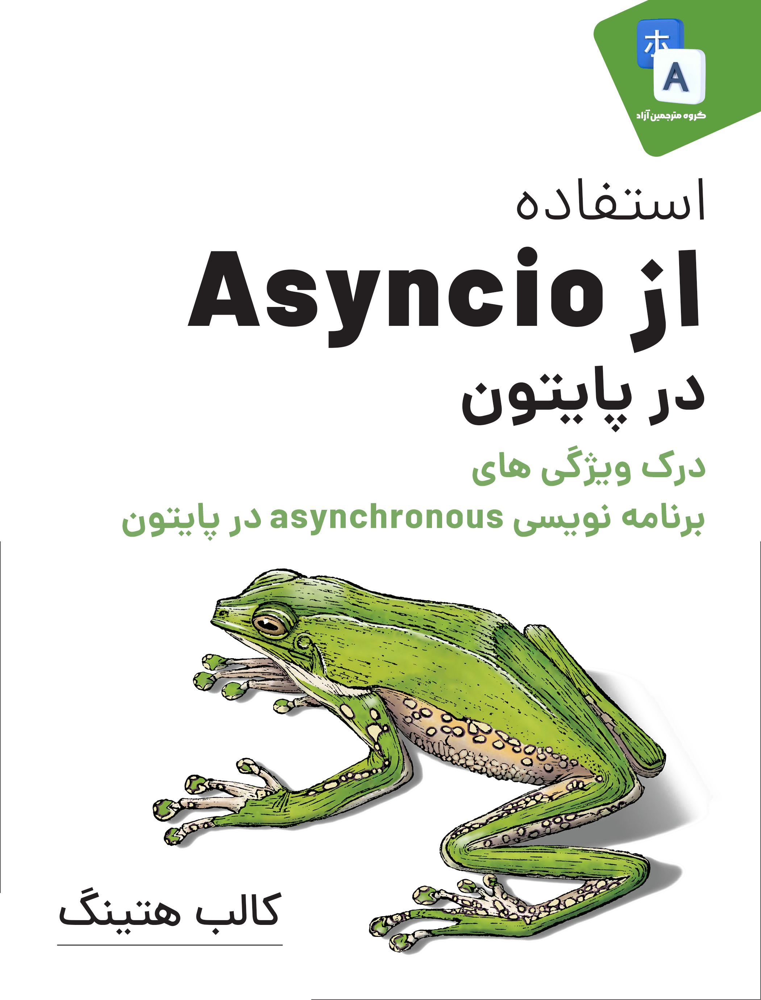

# aip-persian

ترجمه آزاد کتاب Asyncio in Python

قبل از شروع فهرست کتاب، اگر مایل به مشارکت هستید، [نحوه مشارکت](CONTRIBUTING.md) را حتما مطالعه کنید.

شما می توانید برای کمک کردن و خشنود کردن و انگیزه دادن به تیم ما، اهدای مالی به خیریه‌ی محک داشته باشید.
لینک درگاه خیریه محک در سمت راست صفحه درج شده است. لازم به ذکر است که اگر مبلغی را اهدا کرده اید چون ما بی خبر از آن کار هستیم، یک رسید از آن داخل [گروه تلگرامی ما](https://t.me/dfp_farsi) آپلود کنید.

## فهرست مطالب

## مشارکت کنندگان

| تاریخ اتمام ترجمه      | مترجم | سرفصل     |
| :---:        |    :----:   |          :---: |
| ۳۱ فروردین ۱۴۰۲ | [@Rahimz](https://github.com/Rahimz) | 01 - Introducing Asyncio  |
| |  | 02 - The Truth About Threads |
| ۳۰ اردیبهشت ۱۴۰۲ |[p-ndr@](https://github.com/p-ndr)| 03 - Asyncio Walk-Through 1L-683L |
| ۲۸ تیر ۱۴۰۲ | [@FatemeFouladkar](https://github.com/FatemeFouladkar) | 03 - Asyncio Walk-Through 683L-2142L |
| ۱ فروردین ۱۴۰۲ | [@FatemeFouladkar](https://github.com/FatemeFouladkar) | 04 Asyncio Libraries You Aren’t Using |
| ۱ اسفند ۱۴۰۱| [@mehrawbmh](https://github.com/mehrawbmh) | 05 Concluding Thoughts |
| ۱۵ اسفند ۱۴۰۱ | [@mmdbalkhi](https://github.com/mmdbalkhi) | Appendix A-A Short History of Async Support in Python |
| | [@mmdbalkhi](https://github.com/mmdbalkhi) | Appendix B-Supplementary Material |

